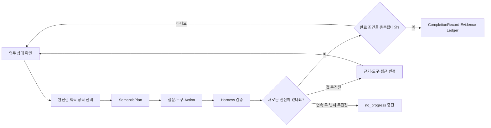
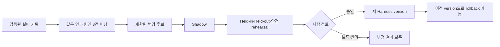

# 이 가이드의 목적

BoI Agent의 Loop는 답변을 길게 만들기 위한 반복이 아니다. 목표를 기계적으로 확인할 수 있고, 매 단계에서 새로운 근거나 실행 결과가 생기며, 중단 후 같은 상태에서 안전하게 재개할 수 있는 업무에만 사용한다.

Harness는 질문 문구를 보고 기능을 바꾸는 규칙 묶음이 아니다. Capability가 허용하는 입력·출력, 필요한 업무 맥락, 실행 도구, 위험도, 완료 조건과 실패 처리를 version으로 고정한 실행 계약이다. 자연어의 의미는 설정된 planner가 `SemanticPlan`으로 판단하고 서버는 계약과 실제 결과만 검증한다.

# 어떤 Loop를 쓰나요

| 종류 | 사용하는 때 | 실행 방식 | 종료 |
|---|---|---|---|
| turn | 일반 질문, 관계 조회, 설명 | plan·act·verify 한 번 | 검증된 답변 또는 근거 부족 |
| goal | 조사, draft, 여러 단계의 확인 | 기본 최대 5 iteration·5 tool call | 명시된 완료 조건 또는 중단 사유 |
| time | 사용자가 정한 시각의 재확인 | 시각마다 bounded child WorkRun 한 번 | 종료 조건, 횟수 또는 사용자 취소 |
| proactive | 업무 Event나 승인된 schedule | trigger마다 독립 child WorkRun | 해당 발생 건의 완료·실패·보류 |

일반 질문을 goal loop로 늘리지 않는다. Event 기반 업무를 프로세스 내부 polling으로 흉내 내지 않고 Business Event와 durable schedule을 사용한다.

# Context를 넉넉하고 정확하게 사용하기

`max_context_tokens=0`은 작은 고정 예산이 아니라 provider가 제공하는 실제 context window를 자동 사용한다는 뜻이다. 로컬 Gemma와 사내 관리형 GPT 계열은 같은 Context Compiler를 사용한다.

- 선택된 대화 turn, 근거, chunk, artifact와 Task를 문자열 길이로 자르지 않는다.
- 물리 용량에 다음 항목 전체가 들어가지 않을 때만 그 항목을 제외한다.
- 제외한 항목과 이유는 `ContextManifest`에 남긴다.
- 긴 파일과 원시 로그는 자료 보관함에 보존하고 checksum·ACL reference와 필요한 profile을 전달한다.
- Deep Work, draft, 독립 evaluator와 Mermaid도 이미 선택된 Context를 다시 4개·6개·12개로 줄이지 않는다.

이 원칙은 큰 context를 무조건 채우라는 뜻이 아니다. 관련성 없는 자료는 retrieval 단계에서 선택하지 않되, 선택한 근거의 의미를 중간에서 훼손하지 않는다는 뜻이다.

# 진전과 중단

각 iteration은 다음 중 하나 이상의 `ProgressDelta`를 남겨야 한다.

- 새 entity 또는 상태 변화
- 새 evidence와 검증 상태
- tool 또는 Action 결과
- 새 artifact
- 사람 입력·승인
- blocker 또는 completion 변화

문장 표현이 달라졌다는 이유만으로 진전으로 계산하지 않는다. 첫 무진전에는 다른 근거, 다른 tool 또는 다른 접근을 구체적으로 선택해야 한다. 같은 상태가 한 번 더 이어지면 `no_progress`로 중단하고 사람이 원인을 확인할 수 있게 남긴다.

# 중단 후 재개와 외부 효과

각 node 경계의 `WorkRunCheckpoint`에는 prompt 문자열이 아니라 raw state, catalog·Harness·planner revision, 현재 loop 위치와 pending interrupt를 저장한다. 재개할 때 같은 revision과 state로 prompt를 다시 구성한다.

사람 입력이나 승인을 기다리는 WorkRun은 실패가 아니라 durable interrupt다. Action, 배정, 승인과 정본 변경은 confirmation 이후 별도 node에서 idempotency key로 실행한다. 네트워크 재시도나 worker 재시작 후에도 같은 외부 효과가 두 번 적용되면 안 된다.

# 실패에서 Harness를 개선하기

실패는 최종 오류명만 남기지 않는다. phase, component, 인과 원인, verifier facts, trace, source·model·Harness revision을 함께 보존한다. 서로 다른 WorkRun 세 건 이상에서 같은 인과 원인이 확인돼야 개선 후보를 만들 수 있다.

후보가 바꿀 수 있는 범위는 versioned HarnessDefinition이 선언한 typed 설정으로 제한한다. v1에서 자동 적용 후보가 될 수 있는 것은 retrieval policy, Context Playbook과 loop policy다. 다음 항목은 후보가 자동 변경할 수 없다.

- ACL, identity, permission과 자료 권한
- verifier 합격 기준과 완료 조건
- confirmation, Autopilot allowlist와 Action 위험도
- planner·evaluator schema와 tool implementation
- Team/Public canonical 정본

후보는 원래 실패 사례, 후보 생성에 사용하지 않은 held-out 사례, 기존 성공 사례와 안전 adversarial 사례를 모두 통과해야 한다. 합격 문구만으로 release하지 않고 사람이 diff와 결과를 검토한다.

# 모델과 실행 환경

Harness 계약은 특정 모델 이름에 맞춘 문자열 규칙을 포함하지 않는다. Capability, operation, effect와 topic은 model이 구조화해 판단하고 Python validator는 의미를 다른 값으로 고치지 않는다.

로컬에서는 이미 띄운 Gemma와 BGE-M3를 사용하며 앱은 load/unload를 호출하지 않는다. 사내에서는 같은 contract에 관리형 GPT-5.5·GPT-5.6을 연결할 수 있다. 모델별로 검증된 Context Playbook과 성능 결과는 분리하되 ACL과 완료 기준은 약한 모델을 보정한다는 이유로 낮추지 않는다.

# 운영 확인 순서

1. WorkRun의 `semantic_plan_ref`, catalog와 Harness revision을 확인한다.
2. ContextManifest에서 선택·제외된 완전한 항목과 provider capacity를 확인한다.
3. Checkpoint와 ProgressDelta가 실제 상태 변화를 나타내는지 확인한다.
4. `stop_reason`이 완료, 사람 대기, 정책 중단, 무진전 또는 예기치 않은 실패 중 무엇인지 확인한다.
5. 외부 효과가 있으면 confirmation과 idempotency 결과를 확인한다.
6. 반복 실패라면 후보를 바로 배포하지 않고 shadow·rehearsal·사람 review로 보낸다.

# 함께 보기

- [WorkContextPack 업무 맥락 계약](/docs/boi:public:boi-wiki-manual:agent:work-context-pack)
- [Work Learning System](/docs/boi:public:boi-wiki-manual:agent:work-learning-system)
- [업무 실행 품질과 Harness 개선 운영 가이드](/docs/boi:public:boi-wiki-manual:operations:harness-observability-and-improvement)
- [BoI Wiki 운영 Runbook](/docs/boi:public:boi-wiki-manual:operations:operator-runbook)
