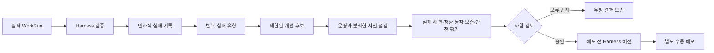

# 목적

BoI Wiki의 Harness는 prompt 한 장이 아니라 모델 주변의 업무 실행 환경이다. 어떤 맥락을 선택하는지, 어떤 도구를 어떤 순서로 쓰는지, 무엇을 완료로 인정하는지, 실패하면 어디서 멈추는지가 모두 Harness에 속한다.

이 가이드는 Agent가 운영 규칙을 마음대로 바꾸게 하는 방법이 아니다. 실제 WorkRun에서 반복되는 실패를 원인별로 모으고, 바꿔도 되는 작은 영역만 격리 시험한 뒤 사람이 배포 여부를 판단하는 운영 기준이다.

# 실패를 원인별로 남기기

표면 증상이 같아도 원인은 다를 수 있다. 예를 들어 흐름 그림이 나오지 않았을 때 검색 근거 부족, Planner 오분류, 관계 검증 실패, Mermaid compiler 오류와 browser blank canvas는 서로 다른 실패다.

`HarnessFailureRecord`는 다음을 함께 보존한다.

- 마지막 verifier가 본 직접 원인과 실패 단계
- 사용한 ContextManifest, 근거와 artifact
- 최근 LoopDelta, Action 결과와 상태 전환
- 사용자 정정과 적용 모델·Harness 버전
- 한 번의 업무 문제인지 반복 가능한 문제인지

같은 인과 원인은 `FailurePattern`으로 묶되 원래 실행 기록을 덮어쓰지 않는다. no-progress, 최대 반복 도달, 사람 blocker, 실패한 작업과 반려된 후보는 `NegativeResult`로 별도 보존한다. 이 기록은 일반 Wiki 정본이 아니며 다음 실행에서 같은 실패 경로를 피하고 운영자가 개선 우선순위를 정하는 데 쓴다.

# 업무 맥락 Playbook

효과가 확인된 맥락 선택법은 거대한 prompt를 매번 다시 쓰지 않고 `ContextPlaybookItem`으로 저장한다.

| 항목 | 의미 |
|---|---|
| 적용 범위 | Capability, 자산 종류, Task와 개인·팀 |
| 모델 범위 | Gemma local, 외부 Agent 등 검증된 profile |
| 내용과 조건 | 언제 어떤 근거와 순서를 먼저 볼지 |
| provenance | canonical source와 검증한 WorkRun |
| freshness | 유효 기간, revision과 갱신 시점 |
| 상태 | provisional, active, deprecated, rejected |

동일 항목은 fingerprint로 중복 생성하지 않는다. 현재 Task, Capability, 팀, model profile과 유효 기간이 맞는 항목만 WorkContextPack에 선택한다. 선택된 항목 수를 임의의 20개 기본값으로 다시 줄이지 않으며 provider capacity에 완전한 항목이 들어가는 만큼 사용한다. 명시적인 Harness limit이 있을 때만 그 제한을 적용한다. Private provisional부터 시작하며 팀 활성화는 검토 권한이 필요하다. 새 항목이 기존 항목을 대체하면 이전 revision을 삭제하지 않고 deprecated와 superseded 관계로 남긴다.

# 바꿀 수 있는 것과 없는 것

제한된 후보가 수정할 수 있는 영역은 HarnessDefinition의 allowlist로 고정한다.

| 시험 가능한 영역 | 자동 변경 금지 영역 |
|---|---|
| Context Playbook과 retrieval policy | ACL·RBAC와 identity |
| 제한 안의 loop policy | planner·evaluator instruction과 schema |
| model profile별 검증된 Context 순서 | tool implementation과 capability 의미 |
| 만료일이 있는 임시 운영 보조 설정 | Action 위험도와 confirmation |
| | Autopilot allowlist·system binding·필수 근거·정본 승격 정책 |

후보가 자동 변경 금지 영역을 포함하면 shadow 전에 차단한다. 반복 예산은 기존 상한보다 늘릴 수 없다. 후보와 평가가 합격해도 production은 바뀌지 않으며 상태는 `approved_not_deployed`로 남는다.

# Shadow와 평가

평가는 후보가 제출한 성공 문구를 신뢰하지 않는다. 서버가 먼저 후보 fingerprint, fixture revision, 변경 가능 영역, 실패 단계와 변경의 관련성, 반복 상한을 확인한다.

1. Held-in: 후보를 만든 실패가 해결되는가
2. Held-out: 이전에 정상 작동한 다른 업무를 망가뜨리지 않는가
3. Adversarial: 권한 우회, 무단 mutation과 근거 없는 완료를 만들지 않는가
4. Long-term: latency, 비용, 사람 개입량과 지식 건강도가 악화되지 않는가

단일 총점보다 metric별 Pareto 경계를 사용한다. 하나라도 회귀하면 후보는 합격하지 않는다. 약한 모델에서 유효한 보조 지침을 강한 모델이나 다른 환경에 자동 복제하지 않도록 model profile을 분리한다.

# 운영 Ontology와 동적 검토 화면

운영자는 HarnessVersion, FailurePattern, HarnessCandidate, EvaluationRun과 ContextPlaybookItem 관계를 Ontology에서 추적할 수 있다. 이 node는 관리자 ACL로 제한되며 일반 업무 관계 그래프와 공용 검색 근거에 노출하지 않는다.

연결 상태의 `업무 실행 품질 개선`을 펼치면 반복 실패 유형, 검토할 후보, 활성 맥락 항목과 보존된 실패 결과를 확인한다. 후보 상세는 허용된 A2UI component로 다음을 보여준다.

- 반복해서 막힌 이유
- 다음 실행에서 시험할 제한된 변경
- 정상 업무 보존과 안전 평가
- 운영에는 아직 반영되지 않았다는 상태

A2UI는 검토 표현일 뿐 배포 권한이 아니다. 승인·Action·배정과 완료 변경은 기존 preview, Harness와 confirmation API를 우회할 수 없다.

# 운영 API

- `GET /api/v2/harness-failures`
- `GET /api/v2/harness-failure-patterns`
- `GET /api/v2/negative-results`
- `GET/POST/PATCH /api/v2/context-playbook`
- `POST /api/v2/harness-candidates`
- `POST /api/v2/harness-candidates/{id}/shadow`
- `POST /api/v2/harness-candidates/{id}/evaluate`
- `POST /api/v2/harness-candidates/{id}/review`
- `GET /api/v2/harness-candidates/{id}/surface`

후보 생성·평가·검토는 관리자 권한이 필요하다. 조회 결과에도 사용자와 팀 ACL을 적용한다.

# 함께 보기

- [Work Learning System](/docs/boi:public:boi-wiki-manual:agent:work-learning-system)
- [BoI Harness와 Loop 운영 가이드](/docs/boi:public:boi-wiki-manual:operations:boi-harness-and-loop-operations)
- [Task·Ontology·동적 화면 검증 기준](/docs/boi:public:boi-wiki-manual:operations:task-ontology-a2ui-acceptance)
- [BoI Wiki 운영 Runbook](/docs/boi:public:boi-wiki-manual:operations:operator-runbook)
- [BoI Wiki Architecture](/docs/boi:team:platform:boi-wiki-architecture-v0.1)
