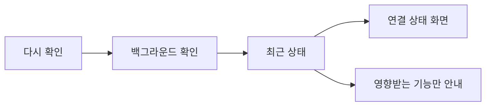
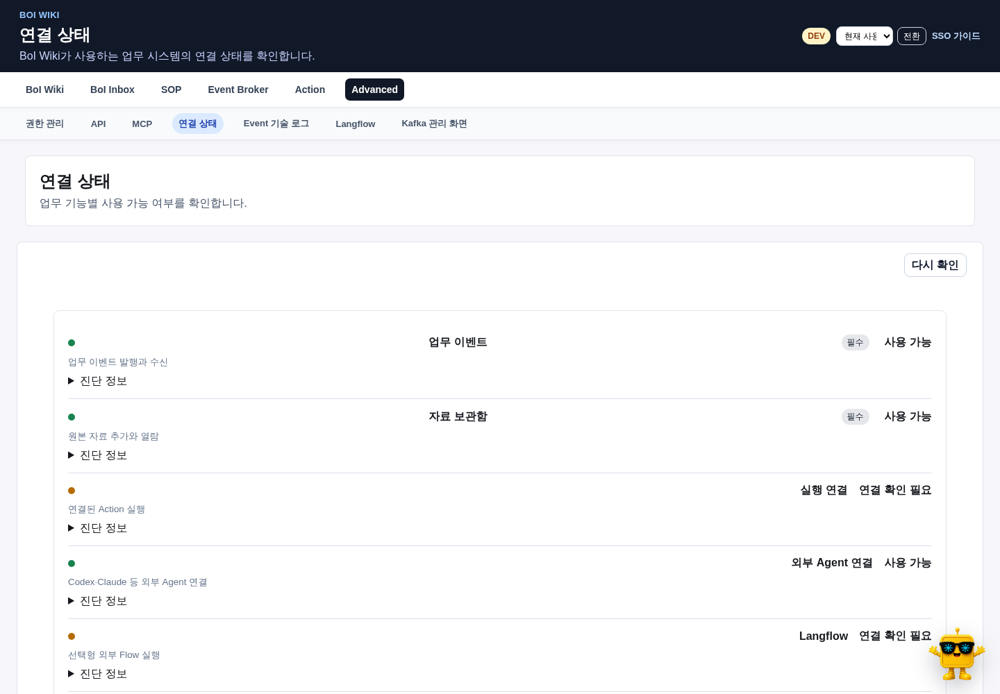

# 연결 상태의 역할

Advanced의 `연결 상태`는 외부 기능이 지금 사용 가능한지 보여주는 운영 화면이다. 화면을 열 때 각 시스템에 직접 연결하지 않고 백그라운드 점검 결과를 읽기 때문에, 느린 저장소나 외부 도구 하나가 다른 메뉴 탐색을 멈추게 하지 않는다.

# 상태별 의미

| 상태 | 사용자에게 미치는 영향 |
|---|---|
| 사용 가능 | 해당 기능을 정상 사용한다 |
| 확인 중 | 최근 상태를 갱신 중이며 정본 조회는 계속한다 |
| 연결 지연 | 해당 저장·실행 기능만 잠시 제한한다 |
| 설정 필요 | endpoint나 credential 같은 운영 설정이 필요하다 |
| 선택 기능 꺼짐 | 핵심 기능 장애가 아니며 필요할 때만 활성화한다 |

# 연결별 확인 내용

| 연결 | 확인하는 것 | 장애 시 범위 |
|---|---|---|
| Kafka | broker와 topic metadata | 새 Event 발행·소비 지연 |
| Data Lake | MinIO liveness와 저장 가능 여부 | 원본 자료 추가·다운로드 제한 |
| MCP | contract version과 핵심 도구 10개 | Codex·Claude 외부 연결 제한 |
| Action Gateway | `/health`와 실행 준비 | Action 실행·dry-run 제한 |
| Langflow | 선택형 connector 상태 | Langflow를 사용하는 Action만 제한 |

Kafka 관리 화면은 Kafka UI 자체가 정상일 때만 Advanced에 나타난다. Kafka UI가 내려가도 broker와 내부 Event Stream이 정상이라면 Event 처리 장애가 아니다.

# 다시 확인과 진단

`다시 확인`은 현재 요청에서 모든 외부 시스템을 기다리지 않고 비동기 확인을 시작한다. 화면은 5초 간격으로 cached 상태를 갱신한다. 사용자 화면에는 기능 영향만 표시하고 hostname, bucket, token과 raw 예외는 운영자 진단에서만 확인한다.

# 관련 문서

- [BoI Wiki 운영 Runbook](/docs/boi:public:boi-wiki-manual:operations:operator-runbook)
- [BoI Wiki API v2](/docs/boi:public:boi-wiki-manual:api:boi-wiki-api-v2)
- [BoI Wiki MCP 등록과 사용](/docs/boi:public:boi-wiki-manual:mcp:register-and-use-boi-wiki-mcp)
