# 목적과 범위

이 문서는 진행자가 SOP 담당자와 함께 **사내 제한 시연(Internal Alpha Preview)** 을 안전하게 준비하고 진행하기 위한 Setup 가이드와 Runbook이다. 제품 안정화, 전체 Golden 평가, 240 holdout, 성능·장시간 실행 또는 전사 배포 판단은 이 시연의 완료 조건이 아니다.

데모 성공 기준은 화려한 답변이 아니라 다음 업무 순환을 증거와 함께 보여주는 것이다.

```mermaid
flowchart LR
  EVENT["샘플 Event 또는 자연어 요청"] --> CONTEXT["현재 맥락과 Wiki 근거"]
  CONTEXT --> REL["사람·조직·업무·시스템 관계"]
  REL --> DRAFT["SOP 초안 또는 기존 Task"]
  DRAFT --> PREVIEW["실행 내용·입력·영향 확인"]
  PREVIEW --> CONFIRM["사용자 명시 확인"]
  CONFIRM --> RESULT["WorkRun·Outcome·Evidence"]
  RESULT --> PRIVATE["private 지식 저장"]
  PRIVATE --> REUSE["새 세션 재사용"]
```



# 역할 분담

| 역할 | 책임 |
|---|---|
| 진행자 | 환경, 계정, 샘플 데이터, 안전한 Action, 대체 자료와 증거 기록 준비 |
| SOP 담당자 | 업무 의미, SOP 단계, 완료 항목과 결과가 실제 업무에 맞는지 판단 |
| 플랫폼 관찰자 | 연결 상태, 권한, 중복 방지, Evidence와 오류 기록 지원 |
| 권한 없는 시험 사용자 | private 지식 비노출 확인만 수행 |

진행자는 참석자의 버튼 클릭을 대신하지 않는다. 실행 확인은 변경 내용을 본 SOP 담당자가 직접 한다.

# Setup 값

환경마다 주소와 계정이 다르므로 아래 표를 데모 초대장이나 비공개 운영 메모에 채운다. 비밀번호와 token은 Wiki에 기록하지 않는다.

| 항목 | 데모 값 | 확인 |
|---|---|---|
| Web 주소 | `<BOI_BASE_URL>` | 브라우저에서 열림 |
| Agent 전체 화면 | `<BOI_BASE_URL>/agent` | 같은 로그인으로 열림 |
| Task Console | `<BOI_BASE_URL>/tasks/console?task_id=<DEMO_TASK_REF>` | 샘플 Task가 보임 |
| MCP 주소 | `<BOI_MCP_URL>` | 비교 시연을 할 때만 사용 |
| 진행자 계정 | `<DEMO_FACILITATOR_ACCOUNT>` | 필요한 시험 권한 보유 |
| SOP 담당자 계정 | `<DEMO_SOP_OWNER_ACCOUNT>` | 자신의 private 지식만 접근 |
| 비노출 확인 계정 | `<DEMO_UNAUTHORIZED_ACCOUNT>` | SOP 담당자의 private 지식 접근 불가 |
| 독립 시험 공간 | `<DEMO_NAMESPACE>` | 다른 시험 데이터와 섞이지 않음 |

`독립 시험 공간`은 다른 시험 데이터와 섞이지 않는 별도 데이터 범위를 뜻한다. 예: `sop-alpha-20260721-a`. 계정과 샘플 Event, Task, Action 입력, 중복 방지용 식별값에 같은 이름을 사용해 나중에 결과를 찾기 쉽게 한다.

# 권한 준비

진행자와 SOP 담당자에게 실제 업무보다 넓은 권한을 임시로 주지 않는다.

- 질문·근거·관계 조회: `boi.viewer`
- private SOP 초안과 private 지식 저장: `boi.editor`
- 샘플 Workflow 수행: 필요한 경우에만 `boi.workflow_runner`
- 샘플 Action 실행 확인: 필요한 경우에만 `boi.action_invoker`
- 관리자 권한은 진행자에게도 기본 부여하지 않는다.

권한 없는 시험 사용자는 조회 권한만 사용한다. URL의 사번 값을 바꾸는 방식으로 다른 사용자를 가장하지 않는다.

# 샘플 데이터 준비

표준 샘플은 repo에 실제로 존재하는 다음 자산을 사용한다.

| 종류 | 샘플 | 용도 |
|---|---|---|
| Event | `equipment.alarm.raised.v1` | 설비 Alarm 발생 업무 시작 |
| SOP | `boi:public:sop:equipment-abnormal-response` | 감지 → 원인 분석 → 보전 가이드 → 조치 흐름 |
| Action | `sop.equipment.request_maintenance_guide` | 보전 가이드 요청 샘플 |
| 샘플 입력 | `equipment_id=DEMO-EQP-01`, `alarm_code=DEMO_RESPONSE_CHAIN` | 운영 설비와 구분 |
| 중복 방지 식별값 | `<DEMO_NAMESPACE>:maintenance-guide:01` | 같은 요청의 결과가 한 번만 반영되는지 확인 |

Action은 현재 카탈로그상 mocked 결과를 반환하는 샘플이다. 다음 조건을 모두 확인하지 못하면 실제 실행을 생략하고 미리보기까지만 진행한다.

1. Action Gateway가 시험 환경을 가리킨다.
2. Action이 사전에 안전하다고 승인된 기능 목록에 들어 있다.
3. 입력에 운영 설비, 실제 Lot/Wafer와 개인정보가 없다.
4. 실행 결과를 되돌리거나 시험 공간 전체를 폐기할 수 있다.
5. 같은 중복 방지 식별값을 다시 사용했을 때 같은 결과를 반환한다.

# 데모 전 기능 준비 상태 확인

`기능을 실제로 사용할 수 있는 준비 상태`를 기술 화면에서는 readiness라고 표시할 수 있다. `ready`, `degraded`, `unavailable`을 각각 `사용 가능`, `일부 연결 제한`, `사용 불가`로 참석자에게 설명한다. 일부 기능이나 연결이 준비되지 않은 제한 상태를 전체 사용 가능으로 설명하지 않는다.

진행자용 확인 예시:

```bash
export BOI_BASE_URL='<BOI_BASE_URL>'
curl -fsS "$BOI_BASE_URL/health"
curl -fsS "$BOI_BASE_URL/api/runtime/config" | python -m json.tool
curl -fsS "$BOI_BASE_URL/api/v2/system/readiness" | python -m json.tool
python scripts/check_local_full_readiness.py --base-url "$BOI_BASE_URL"
```

일반 참석자에게 위 명령이나 raw JSON을 요구하지 않는다. 진행자는 결과를 아래 체크리스트의 쉬운 표현으로 바꿔 전달한다.

## 데모 직전 체크리스트

- [ ] API가 응답한다.
- [ ] DB 연결이 정상이며 WorkSession과 실행 결과가 영속적으로 저장된다.
- [ ] Web 화면과 `/agent`에 접속할 수 있다.
- [ ] MCP 비교가 포함되면 MCP가 연결돼 있다.
- [ ] SOP 담당자, 진행자와 비노출 확인 계정의 권한이 의도와 맞다.
- [ ] 독립 시험 공간에 샘플 Event·Task·Action이 준비됐다.
- [ ] citation을 누르면 정확한 원문 위치가 열린다.
- [ ] 사용한 지식 목록이 실제 source와 일치한다.
- [ ] Ontology 표·Mermaid·Explorer 중 하나 이상이 보인다.
- [ ] Action 실행 전 확인 카드가 실행 내용·입력·영향·승인을 보여준다.
- [ ] 사용자가 확인하기 전에는 데이터가 변경되지 않는다.
- [ ] 같은 중복 방지 식별값의 반복 요청이 실제 결과를 늘리지 않는다.
- [ ] WorkRun, Outcome과 Evidence가 기록된다.
- [ ] private 지식이 새 WorkSession에서 재사용된다.
- [ ] 권한 없는 계정에는 private 지식과 citation이 보이지 않는다.
- [ ] 제한 상태 기능이 전체 `사용 가능`으로 잘못 표시되지 않는다.
- [ ] 실패 시 사용할 같은 버전의 화면 캡처 또는 짧은 녹화가 준비됐다.

하나라도 안전과 관련된 항목이 실패하면 실제 실행 단계를 빼고 읽기·미리보기 데모로 전환한다.

# 시작 전 기준값 기록

실행 전 아래 수를 기록한다. raw ID는 참석자 화면의 필수 정보가 아니며 진행자 증거 메모에만 둔다.

| 항목 | 실행 전 | 실행 후 첫 요청 | 같은 요청 반복 후 |
|---|---:|---:|---:|
| Task 수 |  |  |  |
| Action 실행 결과 수 |  |  |  |
| Outcome 수 |  |  |  |
| Evidence 항목 수 |  |  |  |

첫 요청 후 필요한 결과가 한 건 늘고, 같은 요청 반복 후에는 수가 더 늘지 않아야 한다. 이 확인은 “같은 실행 요청이 반복되어도 실제 결과는 한 번만 반영되도록 중복 실행을 막는 성질”을 검증한다.

# 진행자용 10~15분 실행 순서

## 0~2분: 요청과 현재 맥락

1. SOP 담당자 계정으로 샘플 SOP 또는 Event 문서를 연다.
2. Pet을 열고 현재 문서 제목이 맥락으로 표시되는지 확인한다.
3. “설비 Alarm 대응 업무를 시작하려면 무엇을 확인해야 해?”라고 요청한다.
4. 답변이 샘플 업무, Wiki 근거와 현재 제한을 구분해 표시하는지 본다.

## 2~4분: citation과 사용한 지식

1. citation 하나를 SOP 담당자가 직접 선택한다.
2. 원문 제목, 문단 또는 행, excerpt와 원문 링크를 확인한다.
3. `사용한 지식`을 열어 답변 source와 일치하는지 본다.
4. 근거가 없는 문장이 있으면 `확인하지 못한 내용`으로 분리되는지 확인한다.

## 4~6분: Ontology 관계

1. “이 업무와 연결된 사람·조직·Task·Agent/System 관계를 보여줘”라고 요청한다.
2. 표, Mermaid 또는 Explorer에서 설비 대응 SOP와 Event·Task·Action 관계를 확인한다.
3. 관계 하나를 선택해 근거와 관계 종류를 읽는다.
4. Pet → Expanded → Fullpage로 이동하며 WorkSession 제목과 내용이 유지되는지 확인한다.

## 6~8분: SOP 초안 또는 기존 Task

1. “이 근거로 설비 Alarm 대응 SOP 초안을 만들어줘”라고 요청하거나 연결된 기존 Task를 연다.
2. 초안이 private인지, Task에 완료 항목과 필요한 근거가 있는지 확인한다.
3. Task Console로 이동한 뒤 Pet을 열어 같은 Task 맥락인지 확인한다.

## 8~10분: Action 미리보기

1. `장비 보전 가이드 요청` 샘플 Action을 선택한다.
2. 실행 전 확인 카드에서 Action, 입력, 변경 영향, 승인 여부와 시험 식별값을 읽는다.
3. 실행 전 Task·Action·Outcome 기준값이 변하지 않았는지 확인한다.
4. 확인 카드가 불완전하면 실행하지 않고 대체 절차로 전환한다.

## 10~12분: 명시 확인과 중복 방지

1. SOP 담당자에게 “이 샘플 실행을 진행할까요?”라고 묻는다.
2. 담당자가 화면의 `실행 확인`을 한 번 선택한다.
3. WorkRun이 시작되는지 확인하고 같은 중복 방지 식별값으로 요청을 한 번 더 전달한다.
4. 두 번째 요청이 새 Task·Action·Outcome을 만들지 않고 기존 결과를 가리키는지 확인한다.
5. 새 결과가 생기면 즉시 추가 실행을 중지하고 안전 결함으로 기록한다.

## 12~13분: 실제 결과와 Evidence

1. WorkRun의 진행, 완료, 실패 또는 취소 상태를 확인한다.
2. Outcome에서 실행 후 실제로 확인해야 할 결과를 본다.
3. Evidence Ledger에서 완료 항목, 판단과 source의 연결을 확인한다.
4. 실행 성공 문구만 있고 결과 자료가 없으면 완료로 설명하지 않는다.

## 13~15분: private 저장과 새 세션 재사용

1. 검증된 결과에서 `나만의 지식으로 저장`을 선택한다.
2. 새 WorkSession을 만들고 저장한 내용을 질문한다.
3. source와 private 표시가 유지되는지 확인한다.
4. 권한 없는 시험 계정으로 같은 질문을 해 내용과 citation이 보이지 않는지 확인한다.
5. 마지막 30초에 참석자 피드백 양식을 안내한다.

# 화면별 확인 포인트

| 화면 | 진입 | 같은 맥락 확인 |
|---|---|---|
| Pet/Compact | 주요 화면 오른쪽 아래 BoI Agent | 현재 문서·Task 제목과 WorkSession 제목 |
| Expanded | Pet 위쪽 `↗` | 대화, source, 선택 결과 유지 |
| Fullpage | `▣` 전체 화면에서 이어보기 또는 `/agent` | 같은 WorkSession ID, 대화와 artifact |
| Task Console | Task 카드의 열기 또는 `/tasks/console?task_id=<DEMO_TASK_REF>` | Task ref와 Pet의 현재 맥락 |
| Citation | 답변의 citation 선택 | 원문 제목, 위치, excerpt, 원문 링크 |
| 사용한 지식 | `사용한 지식 N개` 또는 모바일 탭 | 실제 사용 source만 표시 |
| Ontology | 관계 요청 결과 | 표·Mermaid·Explorer가 같은 근거 사용 |
| Action 확인 | 실행 요청 뒤 확인 카드 | 실행·입력·영향·승인·시험 식별값 |
| WorkRun | 진행 상태 또는 Task 결과 | 상태, 취소, stop reason |
| Outcome·Evidence | 완료 결과 카드 | 실제 결과와 완료 항목별 근거 |
| private 지식 | 결과의 저장 동작 | private 표시, 새 세션 재사용, 다른 계정 비노출 |

# 실패·지연·연결 제한 시 대체 절차

| 실패 | 사용자 영향 | 진행자가 할 일 | 대체 흐름 |
|---|---|---|---|
| API 또는 DB 준비 안 됨 | 세션·결과 저장을 신뢰할 수 없음 | 실제 실행과 private 저장 중단 | 캡처로 UI 설명, readiness 제한 기록 |
| Web 접속 실패 | 참석자 실습 불가 | 상태 확인 후 반복 재시작하지 않음 | 동일 버전 짧은 녹화 사용 |
| 검색 색인 제한 | 최신 source 누락 가능 | 제한 상태를 알림 | canonical 문서를 직접 열어 citation만 설명 |
| citation 실패 | 답변 근거 검증 불가 | 해당 답을 실행에 사용하지 않음 | 원문 Wiki 문단을 직접 열기 |
| Ontology 또는 Mermaid 실패 | 관계 탐색 제한 | raw code를 보여주지 않음 | 같은 citation의 읽을 수 있는 관계 표 사용 |
| Action 미리보기 실패 | 변경 영향 확인 불가 | 실제 실행 금지 | 준비된 확인 카드와 결과 캡처 비교 |
| 실행 지연 | 중복 클릭 위험 | 추가 클릭 금지, WorkRun만 조회 | 취소 상태 확인 후 사전 기록 결과 사용 |
| 중복 결과 생성 | Task·Action·Outcome 오염 | 즉시 중지, 시험 공간 격리 | 이후 단계를 사전 캡처로 설명하고 결함 기록 |
| private 지식 노출 | 권한 경계 위반 | 즉시 중지, 공유·캡처 최소화 | 보안 담당자에게 비공개 전달 |
| MCP 연결 실패 | 외부 Client 비교 불가 | Web 여정과 분리해 기록 | 준비된 REST/MCP 의미 비교표 사용 |

# Web·REST·MCP·외부 Agent 의미 비교

UI 문구나 생성 문장을 그대로 비교하지 않는다. 같은 요청을 각 Client에서 읽기 전용 또는 preview로 수행한 뒤 다음 의미 필드를 비교한다.

| 의미 | Web | REST | MCP·외부 Agent |
|---|---|---|---|
| 사용자와 권한 | 로그인 사용자 | 인증된 principal | PAT의 현재 사용자·권한 교집합 |
| 같은 작업 | WorkSession | `work_session_id` | `work_session_id`를 후속 요청에 전달 |
| 계획 | 실행 전 확인 카드 | `plan_ref`, revision, checksum | `boi_plan` 결과의 plan |
| 근거 | citation, 사용한 지식 | `citations`, `used_source_refs`, `evidence_refs` | `boi_get`으로 같은 citation/evidence 조회 |
| 사용자 확인 | `실행 확인` | plan 확인 요청 | `boi_confirm` |
| 중복 방지 | 같은 요청의 기존 결과 | 같은 `idempotency_key` | 같은 `idempotency_key` |
| 진행과 결과 | WorkRun, Outcome | `work_run_id`, outcome ref | `boi_get`으로 같은 run/outcome 조회 |

다음 API와 MCP surface가 실제로 존재한다.

- REST: `/api/v2/bootstrap`, `/api/v2/agent/turns`, `/api/v2/work-sessions`, `/api/v2/citations/{id}`, `/api/v2/work-runs/{id}`, `/api/v2/outcomes/{ref}`, `/api/v2/capabilities/{id}/plan`, `/api/v2/plans/{id}/confirm`, `/api/v2/notes/from-turn`, `/api/v2/ontology/query`
- MCP: `boi_bootstrap`, `boi_agent`, `boi_search`, `boi_get`, `boi_plan`, `boi_confirm`

이 목록 중 Outcome과 Ontology query는 진행 중인 dirty North Star 안정화 checkout의 코드와 로컬 runtime에서 확인됐다. 문서 브랜치 기준 commit `7d7f22f2`만으로 만든 build에는 아직 포함되지 않는다. 데모 직전 통합 build의 route와 MCP `boi_get` 지원 범위를 다시 확인하고, 기능이 정식으로 통합되지 않았다면 같은 의미 비교 항목을 미검증으로 남긴다.

실제 실행 요청은 Client 간 비교에 사용하지 않는다. 한 Client에서 한 번만 실행하고 나머지는 같은 WorkRun과 Outcome을 조회한다.

# 현재 감사 결과

2026-07-21에 `/home/chokukil/boi-wiki`의 코드와 로컬 runtime을 읽기 전용으로 확인했다.

| 항목 | 확인 결과 | 데모 판단 |
|---|---|---|
| UI route와 component | `/agent`, task ID가 필요한 `/tasks/console`, citation, 사용한 지식, Ontology Explorer, ActionPreview, Confirmation 경로 존재 | 샘플 Task를 준비한 데모 환경에서 브라우저 재확인 필요 |
| 로컬 API `http://localhost:8769` | `/health` 응답 | API 단독 읽기 확인 가능 |
| 준비 상태 | `core_ready=true`, 전체 `state=degraded` | 전체 사용 가능으로 설명 금지 |
| DB·저장소 | Postgres 미연결, memory store | private 지속성·재시작 복원 데모 불가 |
| 검색 색인 | 준비되지 않음 | 최신 검색과 citation 전체 여정 미검증 |
| worker | 준비되지 않음 | Deep Work와 비동기 실행에 의존 금지 |
| Docker Web `http://localhost:28000` | 응답하지 않음 | 현재 로컬 상태를 데모 환경으로 사용 금지 |
| A2UI 관측 | Answer/Citation/표/Mermaid/Ontology 관측, ActionPreview/Confirmation 최근 관측 0 | Action 사전 smoke 필수 |
| 문서 브랜치 단독 build | dirty North Star 안정화 변경을 포함하지 않음 | 데모 대상 아님. 기능이 정식 통합된 build 필요 |

이 표는 데모 직전 최신 결과가 아니다. 진행자는 대상 환경에서 체크리스트를 다시 실행하고 결과를 별도 evidence artifact에 기록한다.

이번 감사의 상세 요청·결과와 미실행 범위는 repo 문서 `docs/SOP_INTERNAL_ALPHA_SMOKE_20260721.md`에 기록했다.

# 정식 운영 전에 남은 검증

- Product Golden과 Platform Golden 전체 통과
- 후보 생성에 사용하지 않은 240 holdout 잠금 평가
- citation 정확성, 권한, 중복 방지, 실행 전 확인과 완료 근거의 안전 검증
- Pet·Expanded·Fullpage·Task Console 연속 브라우저 journey
- 실제 사내 계정, PAT, REST와 MCP의 의미 동일성
- private 지식의 영속 저장, 재시작 복원과 교차 사용자 비노출
- 동시 요청, 지연, 취소, 재시도와 장시간 성능
- 샘플 Action의 되돌리기와 장애 복구
- 사내 SOP 담당자 피드백 반영 및 운영 승인

어느 하나도 이번 문서 작업으로 통과했다고 간주하지 않는다.

# 증거 기록 양식

데모 전 smoke와 실제 시연 후 다음 내용을 Markdown artifact에 남긴다.

```text
실행 시각 / 환경 / commit:
독립 시험 공간:
진행자·참석자 역할(사번 제외 가능):
준비 상태 요약:
WorkSession / WorkRun / Outcome reference:
실행 전후 Task·Action·Outcome 수:
같은 요청 반복 결과:
private 새 세션 재사용 결과:
권한 없는 계정 비노출 결과:
실패 원인과 사용자 영향:
사용한 대체 절차:
화면 캡처 또는 짧은 녹화 경로:
남은 미검증 항목:
```

# 관련 문서

- [SOP 담당자 Internal Alpha Preview 사용 안내](/docs/boi:public:boi-wiki-manual:agent:sop-owner-internal-alpha-guide)
- [BoI Wiki 운영 Runbook](/docs/boi:public:boi-wiki-manual:operations:operator-runbook)
- [BoI Agent 사용 가이드](/docs/boi:public:boi-wiki-manual:agent:using-boi-agent)
- [Task·Ontology·A2UI Acceptance](/docs/boi:public:boi-wiki-manual:operations:task-ontology-a2ui-acceptance)
