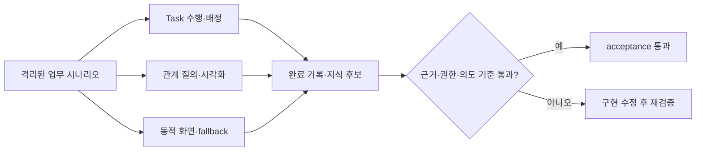

# 무엇을 검증하나

> 현재 상태: core acceptance는 통과했지만 외부 OpenKB release gate, 생성 artifact 최종 응답 p95, cold browser의 Mermaid artifact 직접 진입 검사가 기준을 충족하지 못했다. 이 문서는 해당 항목이 해결될 때까지 `draft`로 유지한다.

Task 수행 화면, 업무 관계 그래프와 동적 결과 화면은 각각 따로 보이는 기능이 아니다. 같은 업무 맥락과 근거를 유지하면서 사람이 실제 일을 수행하고, 관계를 이해하며, 안전하게 결과를 남길 수 있어야 한다.

# 시나리오 구성

목표 acceptance matrix는 Task·Graph·A2UI·지식 순환 32개, Harness 개선 6개와 통합 release 시나리오 12개를 합친 50개다. 각 항목은 fixture에 이름만 존재해서는 통과로 계산하지 않으며, 대응 handler가 실제 API·domain service·browser journey를 실행하고 assertion 결과를 남겨야 한다.

| 영역 | 수 | 확인 내용 |
|---|---:|---|
| Task mode·배정 | 10 | Manual/Copilot/Autopilot, blocker, 근거, 복수 담당자, reviewer, 충돌과 ACL |
| Ontology·시각화 | 10 | 9개 GraphQueryPlan, 시간·방향·종류 필터, provenance, 증분 갱신 |
| 동적 화면 안전성 | 6 | 허용 component, script·외부 URL·event 차단, owner scope와 fallback |
| 지식 순환·parity | 6 | 완료 기록, 후보, 중복·모순, Web·REST·MCP와 탐색 파일 제외 |
| Harness 개선 | 6 | 인과 실패 유형, model별 Playbook, shadow 필수, immutable 경계, 부정 결과, 운영 Ontology |
| Harness release | 4 | 실제 검토 화면, rehearsal, 사람 release와 rollback |
| 외부 Adapter | 6 | CLI export 계약, cancel, retry, restart resume와 rollback |
| 전체 순환·parity | 2 | Work Learning loop와 Web·REST·MCP 의미 계약 |

Agent 의미 평가는 단일 요청뿐 아니라 최소 6개 멀티턴을 포함한다. `그 관계`, `방금 근거`, `이 흐름`을 이어받되 사용자가 새 주제를 명시하면 이전 대상을 강제하지 않아야 한다.

# 합격 기준

- 결정적 테스트: 100%
- Gemma 실모델 시나리오: 90% 이상
- citation 실재성과 ACL: 100%
- 의도 보존·업무 맥락·source 관련성: 각각 90% 이상
- 무단 mutation·근거 없는 완료: 0건
- Task Snapshot warm p95: 500ms 이하, cold: 1.5초 이하
- 1-hop 관계: 200ms 이하, 4-hop path: 500ms 이하
- 일반 탐색과 검증 중 LM Studio load/unload: 0건

GPT-5.5는 기본 acceptance에 사용하지 않는다. Gemma에서 실패하거나 의미가 모호한 사례만 `BOI_GPT55_TEST_MODE=1`을 명시한 별도 평가 대상으로 내보낸다.

# 현재 검증 상태

2026-07-13 기준으로 50개 handler와 12개 browser journey, production-like Gemma 의미 평가를 실행했다. core 기능과 Graphify release gate는 통과했지만 OpenKB 실제 add와 생성 artifact 응답 시간은 미통과다.

| 검증 | 결과 |
|---|---:|
| 결정적 시나리오 | 50/50 |
| clean 전체 회귀 | 810 passed · 22분 27초 · repo 외부 격리 TMP runtime |
| 브라우저 journey | 12/12 · 3 viewport · console 오류 0 |
| Gemma 단일·멀티턴 의미 평가 | 17/17 · 모든 평가 지표 100% |
| Snapshot 5회 p95 | 26.24ms |
| 1-hop 관계 5회 p95 | 14.05ms |
| grounded prose 최대 | 9.81초 |
| 생성 artifact turn p95 | 18.71초 · 기준 미달 |
| Graphify 0.9.13 실제 CLI | 90 node·177 edge 수입 후 rollback 통과 |
| OpenKB 0.4.4 실제 CLI | LM Studio `json_object` 호환 실패 · release 보류 |
| Mermaid artifact 직접 진입 | 순회·캡처 경로는 통과, 새 headless browser 직접 링크는 `rendering` 정체 · 원인 확인 중 |
| 검색 품질 | Recall@8 1.00 · authoritative Top-3 1.00 |
| Web·REST·MCP parity | 10/10 |
| LM Studio load/unload | 0건 |

실모델 평가는 사용자가 띄운 Gemma만 사용한다. `업무 이벤트와 SOP 관계 설명 → 방금 관계만 Mermaid` 멀티턴에서 직전 citation보다 넓은 검색 후보를 다시 해석해 되묻는 결함을 발견했고, 실제 citation 집합을 후속 표현 변환의 경계로 사용하도록 수정한 뒤 해당 시나리오가 통과했다. 실패와 수정 이력은 날짜별 Team validation 문서에 남기며, 이전의 형식 검사 결과는 역사적 draft로 유지한다.

이 결과는 core 구현의 acceptance이며 전체 플랫폼 완료 선언은 아니다. OpenKB 호환 경계, 생성 artifact p95와 cold Mermaid 직접 진입을 해결하고 최종 clean 전체 회귀를 다시 통과한 뒤에만 이 문서를 `reviewed`로 전환한다. 새 component, relation, Task mode 또는 Adapter 계약을 추가하면 해당 handler와 browser journey를 함께 추가한다.

# 실패를 다루는 원칙

테스트가 실패하면 기준을 낮추지 않는다. 먼저 다음을 구분한다.

1. 구현 결함: 500, 권한 우회, 완료 오판, stale 관계처럼 실제 동작을 수정한다.
2. 평가기 결함: 멀티턴의 첫 주제를 버리거나 citation이 아닌 검색 후보를 채점하면 평가기를 수정한다.
3. 모델 품질: route·근거·의도가 실제로 틀린 경우 시나리오를 유지한 채 planner와 context를 개선한다.

raw 로그는 runtime 검증 artifact이며 정본 지식이 아니다. Wiki에는 기준, 요약 결과, 발견한 결함과 수정 근거만 남긴다.

# 함께 보기

- [Task 수행과 업무 관계 활용 가이드](/docs/boi:public:boi-wiki-manual:workflows:task-execution-ontology-guide)
- [BoI Wiki 운영 Runbook](/docs/boi:public:boi-wiki-manual:operations:operator-runbook)
- [BoI Wiki Architecture](/docs/boi:team:platform:boi-wiki-architecture-v0.1)
- [Ontology 탐색과 외부 지식 Source 활용 가이드](/docs/boi:public:boi-wiki-manual:knowledge:ontology-explorer-and-source-adapters)
- [업무 실행 품질과 Harness 개선 운영 가이드](/docs/boi:public:boi-wiki-manual:operations:harness-observability-and-improvement)
