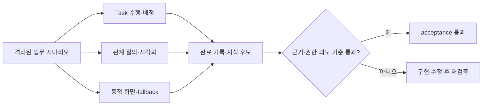

# 무엇을 검증하나

> 현재 상태: acceptance 통과. 결정적 계약, clean 전체 회귀, 실제 브라우저 여정, Gemma 의미 평가, interface parity, Graphify와 OpenKB release gate를 새 코드로 다시 실행했다. cache version을 무효화한 cold grounded 응답도 p95 10초 기준을 통과했다.

Task 수행 화면, 업무 관계 그래프와 동적 결과 화면은 각각 따로 보이는 기능이 아니다. 같은 업무 맥락과 근거를 유지하면서 사람이 실제 일을 수행하고, 관계를 이해하며, 안전하게 결과를 남길 수 있어야 한다.

# 시나리오 구성

목표 acceptance matrix는 Task·Graph·A2UI·지식 순환 32개, Harness 개선 6개와 통합 release 시나리오 12개를 합친 50개다. 각 항목은 fixture에 이름만 존재해서는 통과로 계산하지 않으며, 대응 handler가 실제 API·domain service·browser journey를 실행하고 assertion 결과를 남겨야 한다.

| 영역 | 수 | 확인 내용 |
|---|---:|---|
| Task mode·배정 | 10 | Manual/Copilot/Autopilot, blocker, 근거, 복수 담당자, reviewer, 충돌과 ACL |
| Ontology·시각화 | 10 | 9개 GraphQueryPlan, 시간·방향·종류 필터, provenance, 증분 갱신 |
| 동적 화면 안전성 | 6 | 허용 component, script·외부 URL·event 차단, owner scope와 fallback |
| 지식 순환·parity | 6 | 완료 기록, 후보, 중복·모순, Web·REST·MCP와 탐색 파일 제외 |
| Harness 개선 | 6 | 인과 실패 유형, model별 Playbook, shadow 필수, immutable 경계, 부정 결과, 운영 Ontology |
| Harness release | 4 | 실제 검토 화면, rehearsal, 사람 release와 rollback |
| 외부 Adapter | 6 | CLI export 계약, cancel, retry, restart resume와 rollback |
| 전체 순환·parity | 2 | Work Learning loop와 Web·REST·MCP 의미 계약 |

Agent 의미 평가는 단일 요청뿐 아니라 최소 6개 멀티턴을 포함한다. `그 관계`, `방금 근거`, `이 흐름`을 이어받되 사용자가 새 주제를 명시하면 이전 대상을 강제하지 않아야 한다.

# 합격 기준

- 결정적 테스트: 100%
- Gemma 실모델 시나리오: 90% 이상
- citation 실재성과 ACL: 100%
- 의도 보존·업무 맥락·source 관련성: 각각 90% 이상
- 무단 mutation·근거 없는 완료: 0건
- Task Snapshot warm p95: 500ms 이하, cold: 1.5초 이하
- 1-hop 관계: 200ms 이하, 4-hop path: 500ms 이하
- 일반 탐색과 검증 중 LM Studio load/unload: 0건

GPT-5.5는 기본 acceptance에 사용하지 않는다. Gemma에서 실패하거나 의미가 모호한 사례만 `BOI_GPT55_TEST_MODE=1`을 명시한 별도 평가 대상으로 내보낸다.

# 현재 검증 상태

2026-07-14 기준으로 50개 handler와 21개 실제 browser journey를 다시 실행했다. 브라우저 검증은 숨겨진 fixture나 HTML 문자열 존재를 성공으로 세지 않고 실제 클릭, 입력, canvas pixel, 원문 이동과 상태 복원을 확인한다. grounded 응답 최적화와 cache 무효화까지 포함한 최종 기준 commit은 `cdab2a2`다.

| 검증 | 결과 |
|---|---:|
| 결정적 시나리오 | 50/50 |
| clean 전체 회귀 | 831 passed · 실패 0 · 23분 36초 · deprecation warning 1,904건 |
| 브라우저 journey | 21/21 · fresh runtime · 4 viewport · 예상된 revision 409 외 console 오류 0 |
| Gemma 단일·멀티턴 의미 평가 | 17/17 · 의도·맥락·source 관련성 100% · GPT-5.5 미사용 |
| Task Snapshot p95 | 282.23ms |
| 1-hop 관계 p95 | 33.94ms |
| 4-hop path p95 | 28.92ms |
| 첫 동적 surface update p95 | 25.23ms |
| 생성 graph artifact final p95 | 1.44초 |
| cold 자연어 Mermaid | 6.78초 · `mermaid_diagram` 생성 · 10초 기준 통과 |
| grounded Agent turn cold p95 | 9.08초 · 최대 9.43초 · 10초 기준 통과 |
| grounded Agent turn warm p95 | 6.96초 · 최대 9.69초 |
| Graphify 실제 CLI | 5 node·6 edge 수입 후 rollback 통과 |
| OpenKB 0.4.4 실제 CLI | 실제 PDF에서 private 후보 4개 생성 · navigation 0 · 정본 변경 0 |
| Graph UX | 1440×1000·1180×850·949×1151·390×844, canvas 폭 100%, 하단 inspector·Compact 복원 통과 · hub/Agent/mobile 최소 node 간격 82/170/75px · label overlap 0건 |
| 검색 품질 | Recall@8 100% · authoritative Top-3 100% · 검토 완료 canonical alias 기준 |
| Web·REST·MCP parity | 자연어 route·근거·Task mutation·후보 ID 일치 |
| LM Studio load/unload | 0건 |

실모델 평가는 사용자가 띄운 Gemma만 사용한다. `업무 이벤트와 SOP 관계 설명 → 방금 관계만 Mermaid` 멀티턴은 실제로 `mermaid_diagram`을 반환했지만 평가기가 typed artifact를 표현으로 해석하지 못해 처음 실패로 기록됐다. 평가기를 수정하고, 직전 citation 집합을 후속 표현 변환의 경계로 고정한 뒤 전체 17개 시나리오가 통과했다. 실패와 수정 이력은 날짜별 Team validation 문서에 남기며, 이전의 형식 검사 결과는 역사적 draft로 유지한다.

초기 실행에서는 OpenKB의 `response_format: json_object`가 LM Studio endpoint와 맞지 않았고 생성 artifact p95도 18.71초였다. compatibility gateway가 요청을 일반 JSON 호출로 변환한 뒤 schema를 검증하고, GraphQuery 결과를 추가 모델 호출 없이 deterministic compiler로 artifact화하도록 수정했다. 현재 결정적 실행의 graph artifact p95는 1.71초이며, 선택형 OpenKB CLI gate도 실제 PDF로 다시 실행해 private 후보 4개, 탐색 파일 후보 0개와 정본 변경 0건을 확인했다.

브라우저에서는 9개 관계 질의를 각각 화면에서 전환하고, Timeline이 실제 시간 payload를 표시하는지 확인했다. 자동 확인 starter는 graph artifact가 아니라 guarded Confirmation을 열며, 확인 전에는 routine을 만들지 않는다. Harness는 rehearsal뿐 아니라 사람 release와 rollback까지 실제 API와 감사 이력으로 검증했다.

최종 답변의 모델 처리 시간은 artifact gate와 분리해 기록한다. Planner schema와 route cache를 갱신한 뒤 23개 실제 turn을 cold와 warm으로 각각 실행했다. cold p50은 5.00초, p95는 9.08초, 최대는 9.43초였고 warm p50은 1.83초, p95는 6.96초, 최대는 9.69초였다. 빠른 화면 compile만으로 통과시키지 않고 최종 grounded 응답 자체가 10초 기준을 만족하는지 확인했다.

빠른 지식 답변과 private SOP 초안은 structured Planner가 같은 호출에서 준비한다. 서버는 짧은 source alias를 실제 retrieved ref로 다시 해석하고, 검색 경계 밖 ref와 완료 기준·필수 근거가 없는 초안은 폐기한다. 관련 질문, artifact와 동적 화면을 위한 추가 모델 호출은 만들지 않는다.

이번 재검증의 cold 자연어 Mermaid는 6.78초로 통과했다. 공식 동적 화면 runtime은 `@a2ui/web_core`와 `@a2ui/lit` `0.9.1` exact version을 사용한다. 실제 브라우저에서 lifecycle, data model binding, guarded event와 typed fallback을 확인했으며 모델 load/unload 요청은 0건이었다.

최신 raw evidence는 `.tmp/task-ontology-a2ui-acceptance-latest.json`, `.tmp/task-ontology-a2ui-browser-isolated-final.json`, `.tmp/agent-v2-semantic-cold-final.json`, `.tmp/agent-v2-semantic-final-pass.json`, `.tmp/agent-v2-interface-parity-latest.log`, `.tmp/agent-v2-search-quality-latest.log`, `.tmp/pytest-full-final-pass.log`에 남겼다. raw 로그는 runtime 증거이며 Wiki 정본으로 승격하지 않는다.

새 component, relation, Task mode 또는 Adapter 계약을 추가하면 해당 handler와 browser journey를 함께 추가하고 이 문서를 다시 검증 상태로 전환한다.

# 실패를 다루는 원칙

테스트가 실패하면 기준을 낮추지 않는다. 먼저 다음을 구분한다.

1. 구현 결함: 500, 권한 우회, 완료 오판, stale 관계처럼 실제 동작을 수정한다.
2. 평가기 결함: 멀티턴의 첫 주제를 버리거나 citation이 아닌 검색 후보를 채점하면 평가기를 수정한다.
3. 모델 품질: route·근거·의도가 실제로 틀린 경우 시나리오를 유지한 채 planner와 context를 개선한다.

raw 로그는 runtime 검증 artifact이며 정본 지식이 아니다. Wiki에는 기준, 요약 결과, 발견한 결함과 수정 근거만 남긴다.

최종 검색 품질 원본은 `.tmp/agent-v2-search-quality-final8.log`에 남겼다.

# 함께 보기

- [Task 수행과 업무 관계 활용 가이드](/docs/boi:public:boi-wiki-manual:workflows:task-execution-ontology-guide)
- [BoI Wiki 운영 Runbook](/docs/boi:public:boi-wiki-manual:operations:operator-runbook)
- [BoI Wiki Architecture](/docs/boi:team:platform:boi-wiki-architecture-v0.1)
- [Ontology 탐색과 외부 지식 Source 활용 가이드](/docs/boi:public:boi-wiki-manual:knowledge:ontology-explorer-and-source-adapters)
- [업무 실행 품질과 Harness 개선 운영 가이드](/docs/boi:public:boi-wiki-manual:operations:harness-observability-and-improvement)
