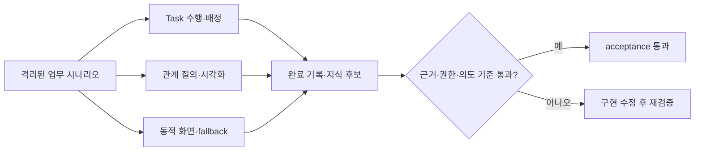

# 무엇을 검증하나

Task 수행 화면, 업무 관계 그래프와 동적 결과 화면은 각각 따로 보이는 기능이 아니다. 같은 업무 맥락과 근거를 유지하면서 사람이 실제 일을 수행하고, 관계를 이해하며, 안전하게 결과를 남길 수 있어야 한다.

# 시나리오 구성

결정적 acceptance는 32개다.

| 영역 | 수 | 확인 내용 |
|---|---:|---|
| Task mode·배정 | 10 | Manual/Copilot/Autopilot, blocker, 근거, 복수 담당자, reviewer, 충돌과 ACL |
| Ontology·시각화 | 10 | 9개 GraphQueryPlan, 시간·방향·종류 필터, provenance, 증분 갱신 |
| 동적 화면 안전성 | 6 | 허용 component, script·외부 URL·event 차단, owner scope와 fallback |
| 지식 순환·parity | 6 | 완료 기록, 후보, 중복·모순, Web·REST·MCP와 탐색 파일 제외 |

Agent 의미 평가는 단일 요청뿐 아니라 최소 6개 멀티턴을 포함한다. `그 관계`, `방금 근거`, `이 흐름`을 이어받되 사용자가 새 주제를 명시하면 이전 대상을 강제하지 않아야 한다.

# 합격 기준

- 결정적 테스트: 100%
- Gemma 실모델 시나리오: 90% 이상
- citation 실재성과 ACL: 100%
- 의도 보존·업무 맥락·source 관련성: 각각 90% 이상
- 무단 mutation·근거 없는 완료: 0건
- Task Snapshot warm p95: 500ms 이하, cold: 1.5초 이하
- 1-hop 관계: 200ms 이하, 4-hop path: 500ms 이하
- 일반 탐색과 검증 중 LM Studio load/unload: 0건

GPT-5.5는 기본 acceptance에 사용하지 않는다. Gemma에서 실패하거나 의미가 모호한 사례만 `BOI_GPT55_TEST_MODE=1`을 명시한 별도 평가 대상으로 내보낸다.

# 최근 검증 결과

2026-07-13 로컬 acceptance에서는 32개 시나리오 계약을 모두 읽고 Task Snapshot p95 300.24ms, 1-hop 관계 조회 p95 22.89ms를 확인했다. 이미 실행 중인 `google/gemma-4-26b-a4b-qat`와 `text-embedding-bge-m3`는 검증 전후 동일했고 load·unload 요청은 모두 0건이었다.

Gemma 의미 평가는 단일·멀티턴 17개 중 16개가 한 번의 전체 실행에서 통과해 94.1%를 기록했다. routing, operation, safety, 의도 보존, 업무 맥락 활용, source 관련성과 무단 전환 방지는 모두 100%였다. 전체 실행에서 한 Mermaid 생성은 결정적 관계 검증을 두 번 통과하지 못해 실패로 남겼고, 같은 시나리오의 독립 재실행에서는 실제 `mermaid_diagram` artifact까지 생성됐다. 이 결과는 성공으로 덮어쓰지 않고 로컬 모델 출력 변동성의 잔여 위험으로 관리한다.

REST·MCP v2·Agent Kit parity에서는 자연어 route, canonical citation, Context evidence, deterministic search ID, WorkRun continuation과 KnowledgeCandidate ID가 모두 일치했다. 표, Timeline, Mermaid, 관계 탐색은 저장된 `boi-a2ui/v1` surface를 실제 DOM으로 렌더링했고, 데스크톱·중간 폭·모바일에서 가로 overflow와 console 오류가 없었다.

# 실패를 다루는 원칙

테스트가 실패하면 기준을 낮추지 않는다. 먼저 다음을 구분한다.

1. 구현 결함: 500, 권한 우회, 완료 오판, stale 관계처럼 실제 동작을 수정한다.
2. 평가기 결함: 멀티턴의 첫 주제를 버리거나 citation이 아닌 검색 후보를 채점하면 평가기를 수정한다.
3. 모델 품질: route·근거·의도가 실제로 틀린 경우 시나리오를 유지한 채 planner와 context를 개선한다.

raw 로그는 runtime 검증 artifact이며 정본 지식이 아니다. Wiki에는 기준, 요약 결과, 발견한 결함과 수정 근거만 남긴다.

# 함께 보기

- [Task 수행과 업무 관계 활용 가이드](/docs/boi:public:boi-wiki-manual:workflows:task-execution-ontology-guide)
- [BoI Wiki 운영 Runbook](/docs/boi:public:boi-wiki-manual:operations:operator-runbook)
- [BoI Wiki Architecture](/docs/boi:team:platform:boi-wiki-architecture-v0.1)
