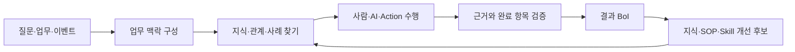

> 사람·팀·Task·SOP·Event·Action 관계를 질문하고 표, 시간 흐름, Mermaid와 관계 탐색으로 확인하는 방법은 [업무 관계와 동적 결과 활용 가이드](/docs/boi:public:boi-wiki-manual:agent:work-relations-and-dynamic-results)를 참고한다.

# BoI Wiki란

BoI Wiki는 문서 검색 서비스와 업무 실행 시스템을 분리하지 않는다. 접근 가능한 Wiki 전체에서 관련 지식과 과거 사례를 찾고, SOP와 Task를 수행하며, 판단 근거와 결과를 다음 업무에서 재사용할 수 있는 BoI 자산으로 남긴다.

BoI Agent에서는 근거가 있는 답변과 관계를 확인하고, 업무 흐름은 Mermaid로, 시간에 따른 변화는 Timeline으로, 넓은 관계는 연결 관계 화면으로 살펴볼 수 있다. Task를 수행할 때는 확인한 내용, 조치, 판단, 결과와 사용 근거를 같은 업무 기록에 남긴다. 상세 동적 결과와 입력 화면은 현재 검증 중이며, 지원되지 않거나 검증에 실패한 결과는 하나의 기본 화면으로 복구한다.

정본은 OKF Markdown, JSONL, catalog와 Git이다. Postgres/pgvector, ontology graph와 검색 index는 정본에서 다시 만들 수 있는 조회 모델이다. 긴 원본 파일은 `자료 보관함`에 보존하고 Wiki에는 요약, 표본, checksum과 권한이 적용된 연결만 남긴다.

# 주요 화면

| 화면 | 하는 일 |
|---|---|
| BoI Wiki | 문서, 업무 용어, 관계와 검토된 지식을 찾는다. |
| BoI Agent | 현재 화면을 출발점으로 Wiki 전체를 활용해 질문, 비교, 초안과 업무 수행을 이어간다. |
| BoI Inbox | 자동 생성된 검증 보고서와 업무 흐름을 보고 승인, 반려, 보류, 근거 보완을 기록한다. |
| SOP | Workflow와 Task, 완료된 모습, 확인할 자료, 실행 방식을 설계하고 수행 이력을 본다. |
| Event Broker | 업무가 발생하는 기준을 Event 카탈로그에서 보고, 하위 업무 발생 이력에서 실제 처리 건을 확인한다. |
| Action | 등록된 실행 요청, 입력, 위험도, dry-run과 실제 사용처를 확인한다. |
| 자료 보관함 | 긴 원본 파일을 보존하고 BoI, Task, 보고서의 근거로 연결한다. |
| Advanced | 권한, API·MCP contract와 외부 연결 상태를 진단한다. BoI Agent의 일상 사용 화면은 아니다. |

# 사람과 AI의 협업 방식

| 방식 | 역할 |
|---|---|
| Manual | 사람이 수행하고 판단한다. BoI Agent는 필요한 지식과 기록을 돕는다. |
| Copilot | 내부 또는 외부 AI가 자료와 초안을 준비하고 사람이 최종 확인한다. |
| Autopilot | 허용된 저위험 Action과 시스템에서 확인 가능한 완료 항목만 자동 처리한다. |

# 어디서 시작할까

- 처음 사용한다면 [BoI Wiki 종합 가이드](/docs/boi:public:boi-wiki-manual:guide:final-operator-guide)
- 질문과 검색부터 시작한다면 [BoI Agent 사용 가이드](/docs/boi:public:boi-wiki-manual:agent:using-boi-agent)
- 업무 수행과 판단을 처리한다면 [BoI Inbox와 Task 수행](/docs/boi:public:boi-wiki-manual:inbox:inbox-and-task-guide)
- SOP를 설계한다면 [Workflow/Task Builder 따라하기](/docs/boi:public:boi-wiki-manual:sop-workflows:workflow-task-builder-step-by-step)
- 원본 자료를 업무 근거로 연결한다면 [자료 보관함과 업무 근거](/docs/boi:public:boi-wiki-manual:data-lake:data-lake-artifact-lifecycle)
- 외부 Agent를 연결한다면 [BoI Wiki MCP 등록과 사용](/docs/boi:public:boi-wiki-manual:mcp:register-and-use-boi-wiki-mcp)
- 실제 Event 처리 건을 확인한다면 [Event 카탈로그와 업무 발생 이력](/docs/boi:public:boi-wiki-manual:events:event-catalog-and-work-history)
- 문서·사람·팀·SOP·Event·Action 관계를 탐색한다면 [Ontology 탐색과 외부 지식 Source 활용 가이드](/docs/boi:public:boi-wiki-manual:knowledge:ontology-explorer-and-source-adapters)
- REST API로 연동한다면 [BoI Wiki API v2](/docs/boi:public:boi-wiki-manual:api:boi-wiki-api-v2)
- 반복 실패와 업무 맥락 개선을 운영한다면 [업무 실행 품질과 Harness 개선 운영 가이드](/docs/boi:public:boi-wiki-manual:operations:harness-observability-and-improvement)
- Loop 종류, 종료·재개와 context 예산을 운영한다면 [BoI Harness와 Loop 운영 가이드](/docs/boi:public:boi-wiki-manual:operations:boi-harness-and-loop-operations)
