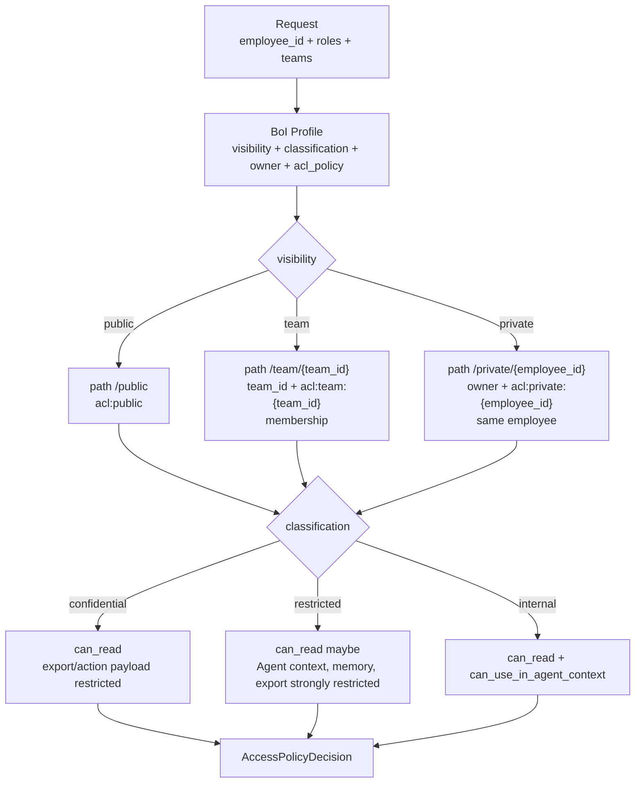

# Summary

BoI Wiki의 접근 제어는 단순 visibility 필터가 아니다. `visibility`, `classification`, `owner`, `team_id`, `acl_policy`, 저장 경로, 요청 사번, 팀 멤버십, 역할을 함께 평가해 `AccessPolicyDecision`을 만든다.

이 decision은 Web UI, BoI API, MCP, Native BoI Agent, Ontology Search, Action Inbox에서 같은 방식으로 사용한다.

# Access Decision Flow

# Required Rules

| Visibility | Required path | Required ACL |
|---|---|---|
| `private` | `data/boi/private/{숫자 사번}/...` | `owner`, `acl_policy: acl:private:{사번}`, 요청 사번이 모두 path 사번과 일치 |
| `team` | `data/boi/team/{team_id}/...` | `team_id`, `acl_policy: acl:team:{team_id}`, 팀 멤버십이 모두 일치 |
| `public` | `data/boi/public/...` | `acl:public` |

`classification`은 접근을 넓히지 않는다. 이미 읽을 수 있는 문서에 추가 제한을 거는 용도다.

Private과 team 문서는 필수 ACL metadata가 빠져도 차단된다. 예를 들어 private 문서가 올바른 사번 폴더 아래에 있더라도 `owner`나 `acl_policy`가 없으면 `AccessPolicyDecision.can_read=false`가 된다. Team 문서도 `team_id` 또는 `acl_policy`가 빠지면 팀 멤버에게도 노출하지 않는다.

# Decision Fields

`AccessPolicyDecision`은 다음 값을 반환한다.

| Field | Meaning |
|---|---|
| `can_read` | 본문과 metadata를 화면에 표시할 수 있는가 |
| `can_use_in_agent_context` | Agent prompt/context에 원문을 넣을 수 있는가 |
| `can_cite` | 답변 citation/link에 노출할 수 있는가 |
| `can_export` | 외부 action payload나 promotion draft에 보낼 수 있는가 |
| `can_edit` | 문서를 수정할 수 있는가 |
| `can_promote` | Team/Public promotion을 만들 수 있는가 |
| `can_invoke_action` | action 실행을 요청할 수 있는가 |
| `can_complete_handoff` | manual handoff 완료를 기록할 수 있는가 |
| `redactions` | 제한 때문에 제거해야 하는 정보 범위 |
| `reasons` | 허용/차단 판단 근거 |

# Lint Boundary

OKF lint는 private/team/public 경로와 ACL 문자열 정책을 검사한다. private 문서가 `data/boi/private/me` 같은 legacy 경로에 있거나 `owner`/`acl_policy`가 빠졌거나 path 사번과 다르면 실패해야 한다. Team 문서도 `team_id`/`acl_policy` 누락 또는 path team과 metadata team 불일치를 실패로 처리해야 한다.

# Break-Glass Boundary

Break-glass는 admin이 사유와 audit을 남기고 다른 사번의 정상 private 문서를 일시적으로 읽는 예외 절차다. 이 절차는 BoI Profile 구조 오류를 우회하지 않는다. 예를 들어 private path, `owner`, `acl_policy`가 서로 맞지 않거나 team path와 `team_id`가 충돌하면 break-glass 요청도 실패해야 한다.

# Related Documents

- [Team RBAC Management](/public/boi-wiki-manual/security/team-rbac-management.md)
- [Agent Guardrail and ACL](/public/boi-wiki-manual/agent/agent-guardrail-and-acl.md)
- [SSO and Permission Model](/public/boi-wiki-manual/security/sso-and-permissions.md)
