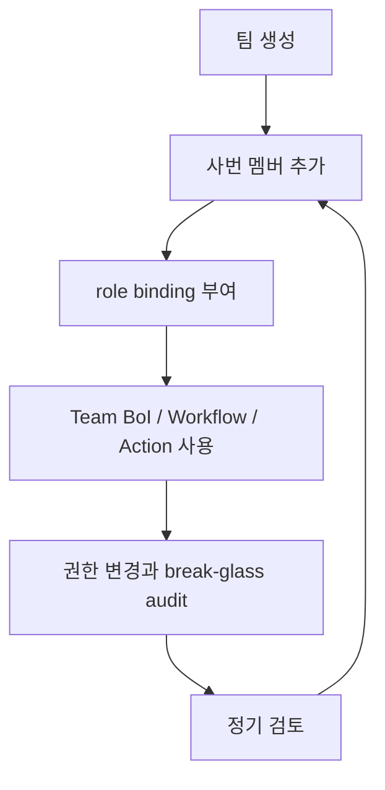

# Summary

BoI Wiki에서 “팀”은 문서 공유와 기능 권한을 부여하는 관리 단위다. 물리 조직과 반드시 같을 필요는 없고, 7자리 숫자 사번을 기준으로 멤버를 추가한다.

MyAccess나 SSO는 시스템 접근과 사번 확인을 담당한다. BoI 문서, workflow, action, promotion 같은 세부 권한은 BoI Wiki RBAC가 담당한다.

# Lifecycle

# Roles

| Role | User-facing meaning |
|---|---|
| `boi.viewer` | 접근 가능한 BoI와 runtime evidence 조회 |
| `boi.editor` | 권한 범위의 draft/source/body 수정 |
| `boi.workflow_runner` | Event 발행, workflow start, manual handoff completion |
| `boi.action_invoker` | Action Gateway 요청 실행 |
| `boi.promoter` | Team/Public promotion draft와 apply |
| `boi.admin` | 권한 관리와 break-glass 운영 |

# UI and API

권한 관리는 상단 utility 메뉴의 `권한 관리`에서 확인한다.

| API | Purpose |
|---|---|
| `GET /api/rbac/me` | 현재 사번의 팀, 역할, 정책 버전 |
| `GET|POST /api/rbac/teams` | 팀 조회와 생성 |
| `POST /api/rbac/teams/{team_id}/members` | 7자리 사번 멤버 추가 |
| `GET /api/rbac/roles` | 역할 목록 |
| `GET /api/rbac/audit` | 권한 변경, break-glass, Agent 실행 승인 audit 조회 |
| `POST /api/rbac/bindings` | 역할 binding 추가 |
| `POST /api/rbac/check` | 특정 역할/범위 검증 |

# Guardrails

- 팀 문서는 팀 멤버에게만 보인다.
- 팀 멤버 사번은 7자리 숫자만 허용한다. 개인 별칭이나 6자리 임시 값은 RBAC membership에 넣지 않는다.
- employee role binding의 `subject_id`도 7자리 숫자 사번만 허용한다. team role binding은 `team_id`를 사용한다.
- `team_id`와 `acl:team:{team_id}`가 다르면 lint와 access decision에서 실패한다.
- `team_id` 또는 `acl_policy`가 빠진 team 문서는 팀 멤버에게도 노출하지 않는다.
- role binding은 문서 visibility를 넓히지 않는다. 문서 접근은 BoI Profile ACL을 먼저 통과해야 한다.
- Admin도 private 문서 원문 열람은 기본 차단되며 break-glass 사유와 audit이 필요하다.
- Break-glass는 정상 BoI Profile에 대한 예외 접근일 뿐이다. path, owner, `acl_policy`, `team_id`가 충돌하는 구조적 오류는 break-glass로도 우회하지 않는다.

# Related Documents

- [BoI Profile ACL Policy](/public/boi-wiki-manual/security/boi-profile-acl-policy.md)
- [Agent Guardrail and ACL](/public/boi-wiki-manual/agent/agent-guardrail-and-acl.md)
