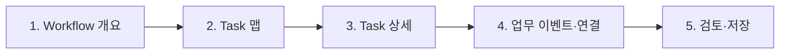
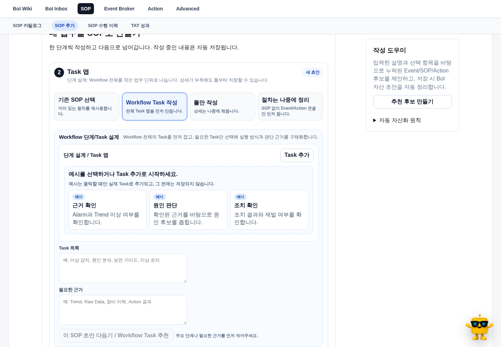

# 무엇을 만드는 화면인가

SOP Builder는 Workflow 전체와 Task를 설계하고, 업무가 언제 시작되며 각 Task에서 누가 무엇을 확인하고 어떤 결과를 남길지 정하는 화면이다. 내부 ID나 connector부터 입력하지 않는다.



위 단계는 선행 입력과 관계없이 탐색할 수 있다. 추천, 초안 생성, 검증이나 게시처럼 의존 정보가 필요한 작업을 누를 때만 부족한 입력을 안내한다.

# 1. Workflow 개요

먼저 어떤 상황에서 어떤 판단과 결과를 남길지 적는다.

| 질문 | 예시 |
|---|---|
| 어떤 업무인가 | 설비 Alarm 발생 시 이상 원인을 확인하고 조치한다. |
| 어떤 상황인가 | 동일 Alarm이 반복되거나 Trend 이상이 함께 발생했다. |
| 무엇을 판단하나 | 즉시 조치, 보전 요청 또는 추가 분석이 필요한가? |
| 무엇을 확인하나 | Alarm 내용, Trend, Raw Data, 이전 조치 이력 |
| 무엇을 남기나 | 판단 기록, 조치 결과, 보고서 BoI |

이 정보는 Task, 업무 이벤트, Action과 Skill 추천의 기준이 된다.

# 2. Task 맵

처음 진입할 때 `첫 Task` 같은 가짜 입력을 저장하지 않는다. Task가 없으면 `근거 확인`, `원인 판단`, `조치 확인` 같은 예시 카드만 보인다. 예시를 선택한 순간 새 Task가 생기고 편집할 수 있다.

`Task 추가`는 목적과 판단 문장을 임의로 채우지 않은 빈 Task를 만든다. 실행 방식처럼 select 기본값이 필요한 항목만 초기값을 가진다.

좋은 Task는 한 사람이 한 번의 판단과 결과를 남길 수 있는 크기다.

- Alarm 맥락 확인
- Trend와 Raw Data 확인
- 원인 후보 판단
- 보전 가이드와 Handoff 검토
- 조치 결과 확인



# 3. Task 상세

Task 기본 편집에는 다음만 먼저 보인다.

- Task 이름과 목적
- Manual, Copilot, Autopilot
- 언제 이 일이 끝났다고 볼지
- 무엇을 확인할지
- 남길 결과

Action, Event, Skill, TAT, fallback과 raw binding은 `실행 연결` 상세 영역에 둔다.

## 수행 방식

| 방식 | 작성 기준 |
|---|---|
| Manual | 담당자가 직접 확인하고 체크할 완료된 모습을 작성한다. |
| Copilot | AI가 준비할 자료와 사람이 마지막으로 확인할 모습을 작성한다. |
| Autopilot | 시스템에서 확인 가능한 상태 변화나 Action 결과를 선택한다. |

Copilot은 BoI Wiki Agent뿐 아니라 ChatGPT, Claude, Excel, 사내 도구와 별도 스크립트의 도움도 포함한다. 외부 결과는 요약, checksum, 원본 URL과 사람 확인을 남긴다.

## 완료된 모습

기술 조건 대신 일상 문장으로 적는다.

- “Alarm 접수가 확인되었어요.”
- “이상 원인 후보가 근거와 함께 기록되었어요.”
- “조치 결과와 담당자 확인이 남았어요.”

## 확인할 자료

직접 ID를 입력하지 않고 BoI 문서, 업무 이벤트, Action 결과, 데이터, 파일, 담당자 메모와 외부 AI 요약에서 고른다. raw ID와 판정 방법은 `연결 정보`에서만 확인한다.

Autopilot에 system binding이 없으면 저장은 가능하지만 `연결 필요`로 표시하고 자동 실행을 막는다.

# 4. 업무 이벤트 정의

이 Workflow가 언제 시작되는지 선택한다.

| 시작 방식 | 설명 |
|---|---|
| 기존 업무 이벤트 | 검토된 Event를 재사용한다. |
| 새 업무 이벤트 정의 | 외부 신호에서 업무 발생 기준을 만든다. |
| 정해진 시간 | 일정에 따라 업무 후보를 만든다. |
| 사람이 직접 실행 | 담당자가 필요할 때 시작한다. |

새 정의에서는 선택한 발생 방식과 source에 필요한 필드만 보인다. API 조회를 고르면 endpoint, method와 주기가, MCP를 고르면 tool과 입력 예시가, Data Lake를 고르면 query와 결과 샘플이 표시된다.

발생 방식과 sample decision은 [업무 이벤트 정의 가이드](/docs/boi:public:boi-wiki-manual:workflows:business-event-definition-guide)를 따른다.

# 5. Action과 실행 연결

Action은 Task에 연결한다. 기존 Action을 먼저 찾아 재사용하고 부족한 경우에만 private 초안을 만든다. Task의 목적, 필요한 입력, 결과 계약과 위험도를 확인한다.

외부 부작용이 있는 Action은 preview 또는 dry-run과 confirmation을 거친다. SOP 초안을 저장했다는 이유로 Action이 운영 catalog에 자동 반영되지 않는다.

# 6. 검토와 저장

검토 화면에서는 다음을 확인한다.

- Workflow 목적과 Task 순서가 이해되는가
- 각 Task의 수행자와 완료된 모습이 명확한가
- 필수 자료가 실제로 확보 가능한가
- Autopilot 항목에 system binding이 있는가
- 업무 이벤트가 너무 넓거나 중복되지 않는가
- Action 결과와 최종 BoI가 정의됐는가

초안 저장과 게시 요청은 다르다. validation과 권한 검증 전에는 Event Broker와 Action Gateway runtime을 변경하지 않는다.

# BoI Agent에서 시작한 SOP

BoI Agent가 만든 SOP artifact를 전체 편집기로 열면 같은 `work_session_id`, `artifact_id`와 revision을 유지한다. 편집 후 `BoI Agent로 돌아가기`를 누르면 수정된 Task와 선택 위치를 같은 작업공간에서 이어간다.

Task의 `완료 항목 제안`은 변경 전·후 preview를 보여주고 사용자가 적용할 때만 저장한다.

# 원본 자료 연결

SOP Builder에서는 미래 Task가 요구하는 자료 종류만 설계한다. 실제 CSV, PDF, PPT, 로그와 캡처는 Task 수행, Inbox 판단, 보고서 또는 BoI Agent 작업에서 자료 보관함에 올린다.

# 실행과 TAT 확인

게시된 SOP가 업무 이벤트나 수동 실행으로 시작되면 SOP 수행 이력과 Task Console에서 현재 상태를 확인한다. Workflow TAT와 Task TAT는 실제 Event/Action timestamp에서 계산하고 표본이 부족하면 `실측 전`으로 표시한다.

```bash
export BOI_BASE_URL='<BOI_BASE_URL>'
export DEV_EMPLOYEE_ID='<DEV_EMPLOYEE_ID>'
node scripts/check_workflow_task_builder_tutorial.mjs \
  --base-url "$BOI_BASE_URL" \
  --employee-id "$DEV_EMPLOYEE_ID" \
  --run-smoke \
  --strict
```

`employee_id`는 local dev 호환 인자이며 운영 인증을 대신하지 않는다.

# 관련 문서

- [업무 BoI-first 개념 모델](/docs/boi:public:boi-wiki-manual:concepts:work-boi-first-model)
- [업무 이벤트 정의 가이드](/docs/boi:public:boi-wiki-manual:workflows:business-event-definition-guide)
- [Action 카탈로그와 실행 연결](/docs/boi:public:boi-wiki-manual:actions:multi-action-connector-guide)
- [BoI Inbox와 Task 수행](/docs/boi:public:boi-wiki-manual:inbox:inbox-and-task-guide)
- [SOP Authoring Harness](/docs/boi:public:harness:sop-authoring-harness)
