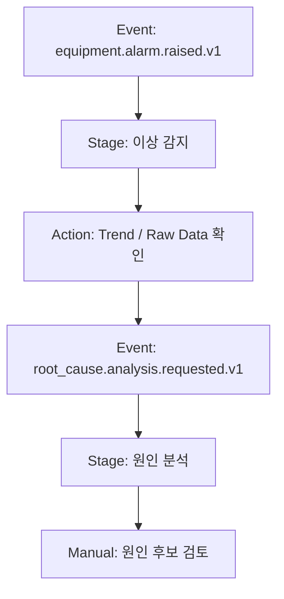

# Summary

SOP Flow Visualization은 사용자가 SOP를 프로세스 플로우로 보고 싶을 때 사용하는 사례다. 기본 산출물은 Mermaid이며, 발표나 매뉴얼용 고정 이미지가 필요할 때만 SVG/PNG를 생성한다.

# User Request

```text
설비 이상 대응 SOP를 Mermaid 프로세스 플로우로 그려줘.
```

# Agent Flow

1. Local workspace에서는 `boi-sop-flow-visualizer` skill을 사용한다.
2. 원격 MCP가 연결되어 있으면 [설비 이상 감지·원인 분석·이상 조치 SOP](/public/sop/equipment-abnormal-response.md), [Event Types](/public/event-types/equipment.alarm.raised.v1.md), [Public Action Library](/public/actions/overview.md)를 조회한다.
3. stage, entry event, emitted event, automated action, manual handoff를 Mermaid node로 만든다.
4. 결과는 Local Private `diagrams`에 저장하고, 공유 요청이 있을 때만 promotion draft를 만든다.

# Mermaid Pattern



# Citations

- [Local Private Agent Harness](/public/harness/local-private-agent-harness.md)
- [SOP Authoring Harness](/public/harness/sop-authoring-harness.md)
- [설비 이상 감지·원인 분석·이상 조치 SOP](/public/sop/equipment-abnormal-response.md)
