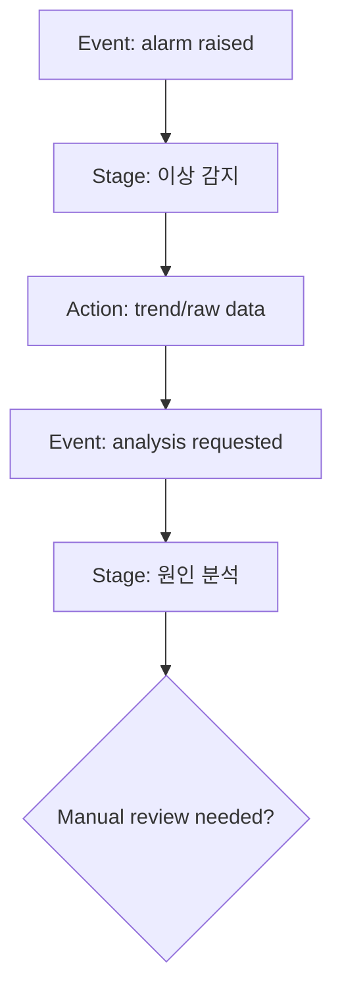
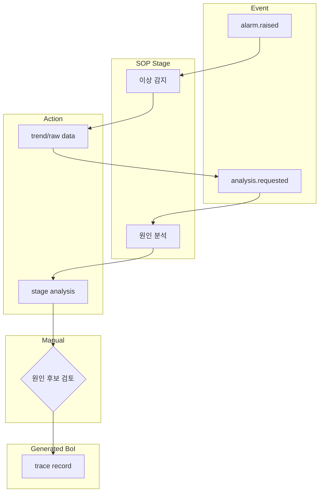

# Summary

SOP Flow Visualization은 사용자가 SOP를 프로세스 플로우로 보고 싶을 때 사용하는 사례다. 기본 산출물은 Mermaid이며, 발표나 매뉴얼용 고정 이미지가 필요할 때만 SVG/PNG를 생성한다. Web BoI Wiki는 `mermaid` fenced block을 실제 diagram으로 렌더링하고, 렌더러가 실패하면 원문 Mermaid source를 fallback으로 보여준다.

# User Request

```text
설비 이상 대응 SOP를 Mermaid 프로세스 플로우로 그려줘.
```

# Agent Flow

1. Local workspace에서는 `boi-sop-flow-visualizer` skill을 사용한다.
2. 원격 MCP가 연결되어 있으면 [설비 이상 감지·원인 분석·이상 조치 SOP](/public/sop/equipment-abnormal-response.md), [Event Types](/public/event-types/equipment.alarm.raised.v1.md), [Public Action Library](/public/actions/overview.md)를 조회한다.
3. stage, entry event, emitted event, automated action, manual handoff, generated BoI를 graph model로 만든다.
4. `Overview + Swimlane` Mermaid를 기본으로 생성한다.
5. 10개 node를 넘거나 branch가 많은 구간은 stage detail diagram으로 분리한다.
6. 결과는 Local Private `diagrams`에 저장하고, 공유 요청이 있을 때만 promotion draft를 만든다.

# Recommended Mermaid Pattern

Overview는 한 화면에서 흐름을 읽는 용도다.



Swimlane은 Event, Stage, Action, Manual Handoff, Generated BoI의 관계를 추적하는 용도다.



# Anti-pattern

아래처럼 모든 설명을 한 노드에 넣고 `LR`로 길게 잇는 방식은 화면 폭을 과도하게 쓰며, 모바일과 문서 본문에서 깨지기 쉽다.

```text
flowchart LR
  A["매우 긴 SOP 단계 설명<br/>시스템명 / 담당자 / action / evidence 전체"] --> B["또 다른 긴 설명"]
```

# Diagram QA

| Check | Rule |
|---|---|
| Node mapping | 모든 node는 SOP stage, event, action, manual handoff, generated BoI 중 하나에 매핑한다. |
| Node id | `evt_detect`, `stage_analyze`, `act_trend` 같은 ASCII stable id를 쓴다. |
| Decision | decision node의 edge에는 `yes`, `no`, `approval required` 같은 label을 둔다. |
| Complexity | overview가 10개 node를 넘으면 stage detail diagram으로 분리한다. |
| Labels | 긴 한글 설명과 시스템명은 node가 아니라 Source Mapping 표에 둔다. |
| Validation | Mermaid preview, source mapping, local index/log 업데이트를 agent가 self-check한다. |

# Citations

- [Local Private Agent Harness](/public/harness/local-private-agent-harness.md)
- [SOP Authoring Harness](/public/harness/sop-authoring-harness.md)
- [설비 이상 감지·원인 분석·이상 조치 SOP](/public/sop/equipment-abnormal-response.md)
