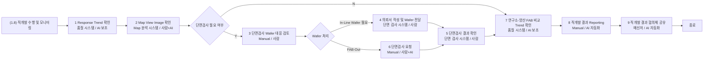

# Summary

이 문서는 사용자가 `boi-wiki-local`에서 자연어로 요청한 내용을 기준으로, local 산출물과 shared BoI Wiki runtime evidence가 어떻게 연결되는지 보여준다. 핵심은 단순 문서 작성이 아니라 `SOP 이미지 -> BoI Local output -> Event Broker -> Action Gateway -> Langflow -> generated BoI -> manual/approval handoff` 흐름을 같은 근거 체계 안에 남기는 것이다.

# Source Image

사용자가 제공한 SOP 이미지는 재생성하지 않고 source evidence로 보존한다.


| Field | Value |
|---|---|
| File | `sop_sample_image.png` |
| SHA-256 | `002cd35720977227fde31bb523d0a34a0039665e6e891e8ecad7dc907fd1b462` |
| Title read from image | 직개발 결과 확인 및 Reporting |
| TAT read from image | 16.5h -> 9.2h, 7.3h 절감 |

# Local Example Set

`boi-wiki-local`에는 아래 예제 세트가 들어간다. `0000000`은 template employee id이며, 실제 사용 시 agent가 `{7자리사번}` workspace로 복사해서 쓴다.

| Natural language request | Execution class | Local example |
|---|---|---|
| 이 회의 내용을 BoI로 정리해줘. | local | [meeting-to-boi.md](https://github.com/chokukil/boi-wiki-local/blob/main/data/boi/private/0000000/usage-examples/natural-language-poc/meeting-to-boi.md) |
| 이 SOP 이미지를 BoI Wiki 형식으로 초안 만들어줘. | local + evidence | [image-to-sop-draft.md](https://github.com/chokukil/boi-wiki-local/blob/main/data/boi/private/0000000/usage-examples/natural-language-poc/image-to-sop-draft.md) |
| 설비 이상 대응 SOP를 Mermaid 프로세스 플로우로 그려줘. | local | [sop-mermaid-flow.md](https://github.com/chokukil/boi-wiki-local/blob/main/data/boi/private/0000000/usage-examples/natural-language-poc/sop-mermaid-flow.md) |
| 이 이벤트가 발생하면 어떤 SOP와 Action이 이어지는지 알려줘. | live workflow evidence | [event-to-action-plan.md](https://github.com/chokukil/boi-wiki-local/blob/main/data/boi/private/0000000/usage-examples/natural-language-poc/event-to-action-plan.md) |
| 기존 API 문서를 BoI Action Spec 초안으로 만들어줘. | local | [api-doc-to-action-spec.md](https://github.com/chokukil/boi-wiki-local/blob/main/data/boi/private/0000000/usage-examples/natural-language-poc/api-doc-to-action-spec.md) |
| 원격 BoI Wiki를 검색해서 이번 업무용 context pack을 만들어줘. | remote lookup optional | [remote-context-pack.md](https://github.com/chokukil/boi-wiki-local/blob/main/data/boi/private/0000000/usage-examples/natural-language-poc/remote-context-pack.md) |
| 만들어진 SOP 내용 괜찮네. Public으로 공유해줘. | approval required | [promotion-public.md](https://github.com/chokukil/boi-wiki-local/blob/main/data/boi/private/0000000/usage-examples/natural-language-poc/promotion-public.md) |
| 팀 주간보고 작성한 거 괜찮아 보이네. 팀 주간보고로 올려줘. | approval required | [weekly-report-promotion.md](https://github.com/chokukil/boi-wiki-local/blob/main/data/boi/private/0000000/usage-examples/natural-language-poc/weekly-report-promotion.md) |
| 오래된 Private BoI 정리 후보 보여줘. | local | [archive-candidates.md](https://github.com/chokukil/boi-wiki-local/blob/main/data/boi/private/0000000/usage-examples/natural-language-poc/archive-candidates.md) |
| MCP 설정은 모르겠으니 local만 써줘. | local-only | [local-only-mode.md](https://github.com/chokukil/boi-wiki-local/blob/main/data/boi/private/0000000/usage-examples/natural-language-poc/local-only-mode.md) |

# Generated SOP Draft

이미지에서 읽은 stage는 local SOP draft로 구조화한다.

| No | Stage | System | Actor | Classification |
|---|---|---|---|---|
| 1 | Response Trend 확인 | 품질 시스템 | AI 보조 | missing system action |
| 2 | Map View Image 확인 | Map 분석 시스템 | 사람 + AI | missing system action |
| D1 | 단면검사 필요 여부 판단 | Manual | 사람 | manual_required |
| 3 | 단면검사 Wafer 대응 검토 | Manual | 사람 | manual_required |
| 4 | 단면검사 의뢰서 작성 및 Wafer 전달 | 단면 검사 시스템 | 사람 | missing system action |
| 6 | 단면검사 요청 | Manual | 사람 + AI | manual + AI candidate |
| 5 | 단면검사 결과 확인 | 단면 검사 시스템 | 사람 | missing system action |
| 7 | 연구소-양산 FAB 비교 Trend 확인 | 품질 시스템 | AI 보조 | missing system action |
| 8 | 직개발 결과 Reporting | Manual | AI 자동화 | Langflow candidate |
| 9 | 직개발 결과 협의체 공유 | 메신저 | AI 자동화 | missing system action |



# Live Runtime Evidence

아래 smoke는 `scripts/run_equipment_sop_poc.py`로 실행했다. source SOP 이미지는 직개발 Reporting 예제이고, runtime evidence는 이미 연결된 설비 이상 SOP harness로 검증했다. 둘의 관계는 "동일한 BoI/E2E 체계를 적용하는 reference evidence"다.

| Evidence | Value |
|---|---|
| Trace ID | `trace-7f03f5a620f540a4b9b7b72c5012bfd8` |
| Events | `equipment.alarm.raised.v1`, `root_cause.analysis.requested.v1`, `maintenance.guide.requested.v1`, `corrective_action.requested.v1` |
| Generated BoI count | 4 workflow BoI docs plus Langflow result docs |
| Langflow invoked | `langflow.boi.reference_flow`, `langflow.equipment.stage_analysis` |
| Approval guard | `sop.equipment.block_process_progress`, `sop.equipment.change_spec_rule` -> `approval_required` |
| Manual handoff | `manual.equipment.confirm_alarm_context`, `manual.equipment.review_root_cause`, approval/maintenance manual actions |


Langflow UI는 SSO/로그인 상태가 필요하다. 아래 이미지는 같은 stage-analysis flow template이 인증된 세션에서 열린 verified screenshot이고, 이번 smoke의 Action Gateway log는 최신 flow id `4cebafa5-f25f-4dfe-a2a5-e722bcfb01e3`를 `langflow_invoked`로 기록했다.


# Generated Output Captures

아래 캡처는 이 문서가 BoI Wiki에서 SOP stage table을 표시하는 화면이다.


아래 캡처는 Mermaid source가 stage 표와 같은 문서에서 확인되는 화면이다.


# Action Classification

| Action class | Meaning | Example |
|---|---|---|
| existing live action | catalog에 있고 smoke에서 `invoked`, `materialized`, `event_published`, `langflow_invoked` 등으로 확인됨 | `sop.equipment.request_trend_history`, `langflow.equipment.stage_analysis` |
| existing manual action | catalog에 있고 사람이 완료해야 하므로 `manual_required`로 남음 | `manual.equipment.review_root_cause` |
| approval action | catalog에 있고 위험도가 높아 승인 전 `approval_required`로 차단됨 | `sop.equipment.block_process_progress` |
| missing system action | SOP에는 있으나 live connector가 아직 없음 | `quality_system.response_trend.query`, `map_analysis_system.map_view.inspect`, `cross_section_inspection_system.cross_section.request`, `messenger.committee.share` |
| AI action candidate | Langflow harness로 만들 수 있으나 아직 connected flow가 없음 | `langflow.direct_development.reporting` |

# Human + AI Collaboration Rule

사람이 실제로 해야 하는 단계는 자동으로 넘기지 않는다. Action Gateway는 `manual_required` 또는 `approval_required`로 멈추고, 담당자가 완료 또는 승인 event를 발생시킨 뒤 다음 stage로 이동한다. Codex 같은 agent가 시뮬레이션할 수 있는 부분은 dry-run 답변으로 남기되, 실제 작업 완료로 기록하지 않는다.

# Reproduce

```bash
python scripts/setup_langflow_reference_flows.py --auth-mode api-key
python scripts/run_equipment_sop_poc.py
python scripts/okf_lint.py --root data --include-logs --strict-media --strict-links
```

SSO dev overlay에서는 `/api/v1/auto_login`이 403일 수 있다. 이 경우 flow가 이미 존재하면 smoke는 Action Gateway에서 `langflow_invoked` evidence를 남긴다.

# Real vs Simulated

- Real: source image, `boi-wiki-local` Markdown outputs, shared runtime trace, Action Gateway raw log, generated Private BoI, verified Langflow action invocation.
- Simulated/candidate: direct-development-specific 품질 시스템/Map 분석 시스템/단면 검사 시스템/메신저 connectors and `langflow.direct_development.reporting`.
- Approval required: Public/Team promotion and high-risk action execution.

# Citations

- [Local Private 시작하기](/public/boi-wiki-manual/local-private/overview.md)
- [SOP Authoring Harness](/public/harness/sop-authoring-harness.md)
- [Action Authoring Harness](/public/harness/action-authoring-harness.md)
- [Multi-action Connector Guide](/public/boi-wiki-manual/actions/multi-action-connector-guide.md)
- [Langflow Connected Flow Guide](/public/boi-wiki-manual/langflow/connected-flow-guide.md)
- [Visibility and Promotion Policy](/public/boi-wiki-manual/operations/visibility-and-promotion-policy.md)
