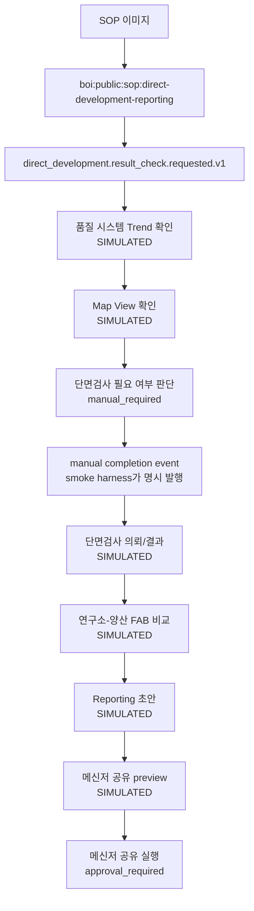

# Summary

이 문서는 사용자가 `boi-wiki-local`에서 "이 SOP 이미지를 BoI Wiki 형식으로 초안 만들어줘"라고 요청했을 때 기대하는 대표 PoC 흐름을 보여준다. 단순한 Markdown 초안이 아니라, 원본 이미지가 public SOP로 자산화되고, 그 SOP가 Event Broker, Action Gateway, Langflow, generated BoI, manual handoff, approval-required 단계까지 실제 trace로 이어지는 구조다.

중요한 경계는 다음과 같다. 사내 시스템은 연결하지 않았다. 품질 시스템, Map 분석 시스템, 단면 검사 시스템, 메신저 호출은 `BoI Universal Action Simulator Flow`를 통한 공식 `SIMULATED` 실행이다. 모든 runtime 화면과 action log에는 `SIMULATED`, `real_system_connected=false`, "실제 시스템 호출 아님"이 남는다.

# Source Image

사용자가 제공한 SOP 이미지는 재생성하지 않고 source evidence로 보존한다.


| Field | Value |
|---|---|
| File | `sop_sample_image.png` |
| SHA-256 | `002cd35720977227fde31bb523d0a34a0039665e6e891e8ecad7dc907fd1b462` |
| Title read from image | 직개발 결과 확인 및 Reporting |
| Redaction | `Tech-A`, 품질 시스템, Map 분석 시스템, 단면 검사 시스템, 메신저, 연구소-양산 FAB |


# Public SOP Asset

원본 이미지는 public redacted SOP인 [직개발 결과 확인 및 Reporting SOP](/public/sop/direct-development-reporting.md)로 정리했다.

| Field | Value |
|---|---|
| BoI ID | `boi:public:sop:direct-development-reporting` |
| Workflow key | `direct-development-reporting` |
| Entry event | `direct_development.result_check.requested.v1` |
| Primary public page | `/docs/boi:public:sop:direct-development-reporting?employee_id=100001&folder=public%2Fsop` |


# Workflow Stages

| Stage | Event | Action class | Evidence boundary |
|---|---|---|---|
| Response Trend 확인 | `direct_development.result_check.requested.v1` | Langflow simulator | `SIMULATED`, 품질 시스템 실제 호출 아님 |
| Map View 확인 | `direct_development.map_view.requested.v1` | Langflow simulator | `SIMULATED`, Map 분석 시스템 실제 호출 아님 |
| 단면검사 판단 | `direct_development.cross_section.decision_required.v1` | Manual | `manual_required`로 멈춤 |
| 단면검사 의뢰/결과 확인 | `direct_development.cross_section.requested.v1` | Langflow simulator | `SIMULATED`, 단면 검사 시스템 실제 호출 아님 |
| 연구소-양산 FAB 비교 | `direct_development.fab_trend.compare_requested.v1` | Langflow simulator | `SIMULATED`, 품질 시스템 실제 호출 아님 |
| Reporting | `direct_development.reporting.requested.v1` | Langflow simulator | `SIMULATED`, 보고 초안 생성 |
| 협의체 공유 | `direct_development.share.requested.v1` | Preview + approval | preview는 `SIMULATED`, 발송은 `approval_required` |



# Live Runtime Evidence

아래 smoke는 새 direct-development SOP 전용 harness인 `scripts/run_direct_development_sop_poc.py`로 실행했다.

| Evidence | Value |
|---|---|
| Trace ID | `trace-f91b32904db0434db27c3f84307103ad` |
| Workflow status | `/workflows/direct-development-reporting/status?employee_id=100001&trace_id=trace-f91b32904db0434db27c3f84307103ad` |
| Raw status API | `/api/workflows/direct-development-reporting/status/raw?employee_id=100001&trace_id=trace-f91b32904db0434db27c3f84307103ad` |
| Langflow flow | `BoI Universal Action Simulator Flow` / `boi-universal-action-simulator` / `9525919a-aad6-43c1-a944-7cdd05c0e566` |
| Manual handoff | `manual.direct_development.decide_cross_section` -> `manual_required` |
| Approval guard | `direct_development.messenger_share.publish` -> `approval_required` |

Observed event chain:

- `direct_development.result_check.requested.v1`
- `direct_development.map_view.requested.v1`
- `direct_development.cross_section.decision_required.v1`
- `direct_development.cross_section.requested.v1`
- `direct_development.fab_trend.compare_requested.v1`
- `direct_development.reporting.requested.v1`
- `direct_development.share.requested.v1`

Observed simulator actions:

- `direct_development.quality_response_trend.simulate`
- `direct_development.map_view.simulate`
- `direct_development.cross_section_request.simulate`
- `direct_development.cross_section_result.simulate`
- `direct_development.fab_trend_compare.simulate`
- `direct_development.reporting.simulate`
- `direct_development.messenger_share_preview.simulate`


# Action Raw Evidence

대표 raw action log:

| Field | Value |
|---|---|
| Action | `direct_development.messenger_share_preview.simulate` |
| Request ID | `act-20260621004811-a985a812` |
| Raw log ref | `action:actions-20260621.jsonl:20` |
| Result | `langflow_invoked` |
| Simulation | `true`, `SIMULATED`, `real_system_connected=false` |


# Generated BoI Evidence

대표 generated BoI:

| Field | Value |
|---|---|
| BoI ID | `boi:private:100001:20260621004811:69f332` |
| Event | `direct_development.share.requested.v1` |
| Meaning | 협의체 공유 preview execution record |
| Simulation marker | Action plan에 `SIMULATED`와 "실제 시스템 호출 아님"이 들어감 |


# Langflow Simulator Evidence

`BoI Universal Action Simulator Flow`는 BoI Wiki Reader, prompt/context normalization, BoI Writer, Action Invoker, Result Composer를 연결한다. 아래 캡처는 dev token-like 값이 보이지 않도록 화면 input을 `[REDACTED]`로 마스킹한 후 저장했다.


# Action Classification

| Action class | Meaning | Direct-development example |
|---|---|---|
| existing live action | catalog에 있고 smoke에서 실제로 실행됨 | `boi.materialize_event`, `direct_development.create_*_event` |
| AI simulator action | 실제 사내 시스템 대신 Langflow official simulator로 실행됨 | `direct_development.reporting.simulate` |
| existing manual action | 사람이 수행해야 해서 자동으로 완료하지 않음 | `manual.direct_development.decide_cross_section` |
| approval action | preview와 분리하고 승인 전 실제 실행하지 않음 | `direct_development.messenger_share.publish` |
| missing system connector | 실제 사내 connector가 아직 없고 simulator로만 검증됨 | 품질 시스템, Map 분석 시스템, 단면 검사 시스템, 메신저 |

# Human + AI Collaboration Rule

사람이 실제로 해야 하는 단계는 agent가 몰래 완료 처리하지 않는다. workflow는 `manual_required`로 멈추고, 담당자가 완료했음을 알리는 event가 발행되어야 다음 stage로 간다. 이번 smoke에서는 end-to-end 검증을 위해 harness가 `manual.direct_development.decide_cross_section`을 dry-run으로 기록한 뒤, 별도 `direct_development.cross_section.requested.v1` completion event를 명시적으로 발행했다.

협의체 공유는 더 강한 경계가 필요하다. preview는 `SIMULATED`로 생성하지만 실제 메신저 공유 action은 `approval_required`로 남긴다.

# Reproduce

```bash
python scripts/setup_langflow_reference_flows.py --langflow-url http://mangugil.iptime.org:27860 --auth-mode auto-login --summary
BOI_API_URL=http://mangugil.iptime.org:28000 POC_SMOKE_TIMEOUT_SECONDS=360 python scripts/run_direct_development_sop_poc.py
python scripts/okf_lint.py --root data --include-logs --strict-media --strict-links
```

# Real vs Simulated

- Real: source image asset, public SOP, event catalog, action catalog, Event Broker chain, Action Gateway logs, Langflow run invocation, generated BoI pages, manual handoff log, approval-required log.
- SIMULATED: 품질 시스템, Map 분석 시스템, 단면 검사 시스템, 메신저의 실제 호출 결과. 이들은 `BoI Universal Action Simulator Flow`가 생성한 PoC evidence이며 실제 시스템 호출이 아니다.
- Approval required: 협의체 메신저 공유. preview까지만 자동 생성하고 실제 발송은 승인 전 실행하지 않는다.

# Citations

- [직개발 결과 확인 및 Reporting SOP](/public/sop/direct-development-reporting.md)
- [Direct Development Reporting Action Spec](/public/actions/langflow/direct-development-reporting-simulate.md)
- [Direct Development Result Check Event Type](/public/event-types/direct_development.result_check.requested.v1.md)
- [Langflow Connected Flow Guide](/public/boi-wiki-manual/langflow/connected-flow-guide.md)
- [Visibility and Promotion Policy](/public/boi-wiki-manual/operations/visibility-and-promotion-policy.md)
