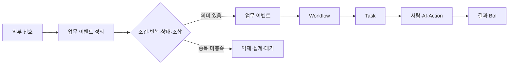
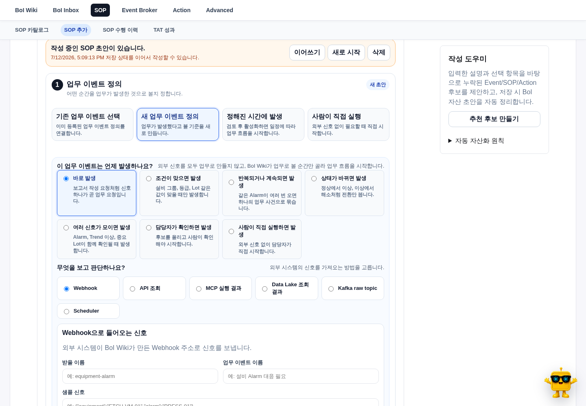

# 업무 이벤트란

업무 이벤트는 외부 시스템의 모든 알림이나 메시지가 아니다. BoI Wiki가 업무적으로 의미 있는 순간이라고 판단해 Workflow를 시작하거나 상태를 전환하는 Event다.

화면의 역할은 다음처럼 구분한다.

| 화면 | 확인하는 것 |
|---|---|
| 업무 이벤트 정의 | 외부 신호를 언제 업무로 볼지 정하는 기준 |
| Event 카탈로그 | Workflow와 Broker가 공유하는 Event Type 정의 |
| 업무 발생 이력 | 실제 Event·SOP·Action·사람 확인·결과 BoI가 이어진 업무 건 |
| Event 기술 로그 | producer, connector, dispatch와 raw JSON 운영 진단 |

# SOP·Action·BoI와의 관계

- 업무 이벤트 정의는 `언제 업무를 시작할지`를 정한다.
- Workflow는 시작부터 완료까지의 전체 흐름이다.
- Task는 Workflow 안에서 사람이 이해하고 수행할 업무 단위다.
- Action은 기본적으로 Task에 연결되는 실행 요청이다.
- BoI는 판단 근거, 실행 결과와 다음에 재사용할 지식을 남긴다.

단순 업무는 이벤트가 바로 저위험 Action 또는 BoI 생성을 요청할 수 있지만, 일반적인 업무는 Workflow와 Task를 거친다.

# 시작 방식

SOP 추가 화면의 업무 이벤트 정의에서 상황에 맞는 방식 하나를 먼저 고른다.

| 방식 | 언제 쓰나 |
|---|---|
| 기존 업무 이벤트 | 이미 검토된 Event Type과 정의를 재사용한다. |
| 새 업무 이벤트 정의 | 외부 신호에서 업무 발생 기준을 새로 정한다. |
| 정해진 시간 | 매일, 매주, 특정 시각에 업무 후보를 만든다. |
| 사람이 직접 실행 | 외부 신호 없이 담당자가 필요할 때 시작한다. |

# 새 업무 이벤트의 발생 방식

| 발생 방식 | 예시 | 필요한 설정 |
|---|---|---|
| 바로 발생 | 명확한 API 요청 하나가 곧 업무다. | 출처, 이벤트 이름, 샘플 |
| 조건이 맞으면 | severity가 critical일 때만 시작한다. | 조건과 샘플 |
| 반복되거나 계속되면 | 같은 Alarm이 10분 안에 5회 발생한다. | 묶을 기준, 시간, 횟수 |
| 상태가 바뀌면 | normal→alarm, alarm→resolved 전환만 본다. | 상태 위치, 이전·이후 상태, 묶을 기준 |
| 여러 신호가 모이면 | Alarm, Trend 이상과 중요 Lot이 함께 확인된다. | 필요한 신호, 구분 필드, 수집 시간 |
| 담당자가 확인하면 | 후보를 Inbox에 올리고 확인 후 시작한다. | 담당자와 확인 정책 |
| 사람이 직접 실행하면 | 현장 판단으로 바로 시작한다. | 이름과 설명 |

# 무엇을 보고 판단하나

채널을 고르면 실제 동작에 필요한 기본 설정만 표시한다.

| 채널 | 기본 설정 |
|---|---|
| Webhook | 받을 이름, 생성 경로, 샘플 신호 |
| API 조회 | endpoint, method, 조회 주기, 대표 응답 |
| MCP 실행 결과 | tool 이름, 실행 입력 예시, 결과 샘플 |
| Data Lake 조회 | query 이름 또는 SQL, 실행 주기, 결과 샘플 |
| Kafka raw topic | source 이름, topic, 샘플 메시지 |
| Scheduler | 일정 설명과 기본 payload |
| 직접 입력 | 수동 실행 이름과 설명 |

값 연결, raw JSON 조건, 인증 정책과 health check는 `고급 설정`에 둔다. source별 필수값은 고급 설정으로 숨기지 않는다.

# 샘플로 확인하기

운영 반영 전에 샘플을 넣어 판단 결과를 확인한다.

| 결과 | 의미 |
|---|---|
| `published` | 업무 이벤트가 발행됐다. |
| `suppressed` | dedupe window 안의 중복이다. |
| `aggregated` | 반복·지속 기준을 모으는 중이다. |
| `pending_confirmation` | 담당자 확인 전이라 발행하지 않았다. |
| `ignored` | 조건에 맞지 않는다. |
| `failed` | 설정이나 판단 과정에 오류가 있다. |

같은 raw Alarm 100건이 들어와도 dedupe window 안에서는 업무 이벤트 한 건만 발행해야 한다. 담당자 확인형은 confirm 전까지 `boi.events`로 보내지 않는다.

# 저장과 실행

1. `발생 기준 미리보기`로 이해한 기준을 확인한다.
2. `샘플로 확인하기`로 실제 decision을 검증한다.
3. 초안으로 저장한다.
4. validation을 통과한 정의만 활성화한다.
5. 활성 정의는 Webhook, API Poll, MCP, Data Lake, Kafka, Scheduler와 Manual Run이 같은 판단 API를 사용한다.

기존 `/api/events/publish`는 이미 업무 이벤트라고 확정된 직접 발행 경로로 유지한다. 외부 raw 신호는 `/api/signals/evaluate`를 거친다.

# 저장 정책

v1 판단 상태는 `BOI_RUNTIME_ROOT/business-event-detector/detector.sqlite3`에 저장한다. raw payload 전체는 기본 저장하지 않고 fingerprint, count, last_seen, 상태값과 decision summary만 남긴다. Kafka raw 입력이 필요할 때만 `boi.raw-signals`를 사용한다.

# 관련 문서

- [BoI Wiki 종합 가이드](/docs/boi:public:boi-wiki-manual:guide:final-operator-guide)
- [Event 카탈로그와 업무 발생 이력](/docs/boi:public:boi-wiki-manual:events:event-catalog-and-work-history)
- [Workflow/Task Builder 따라하기](/docs/boi:public:boi-wiki-manual:sop-workflows:workflow-task-builder-step-by-step)
- [Event Contract](/docs/boi:public:boi-wiki-manual:workflows:event-contract-guide)
- [Action 카탈로그와 실행 연결](/docs/boi:public:boi-wiki-manual:actions:multi-action-connector-guide)
- [업무 BoI-first 개념 모델](/docs/boi:public:boi-wiki-manual:concepts:work-boi-first-model)
