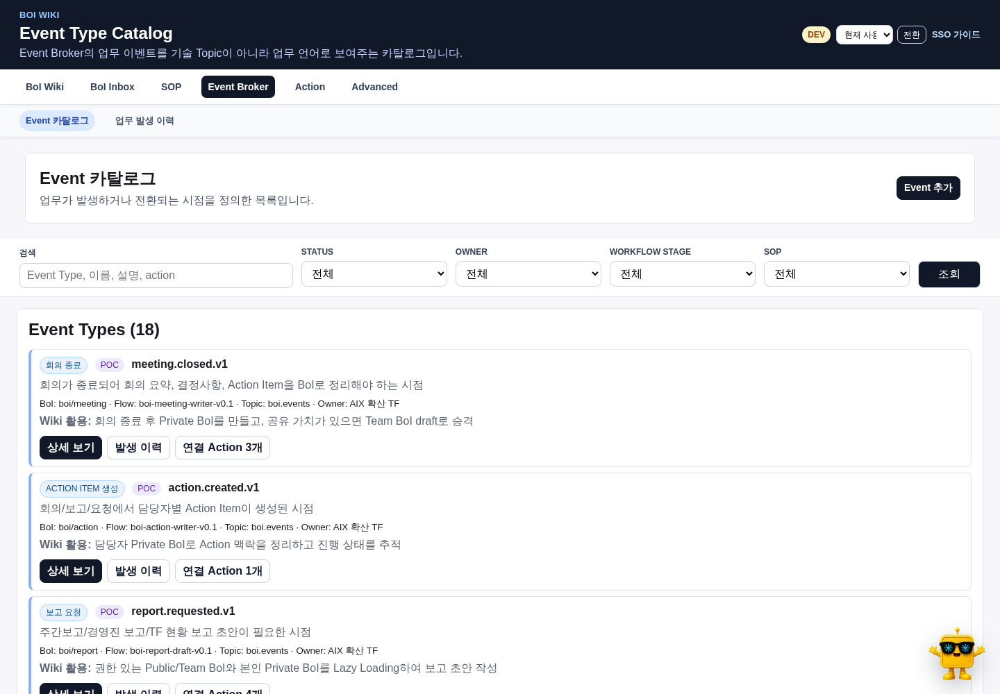
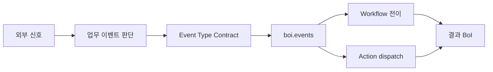
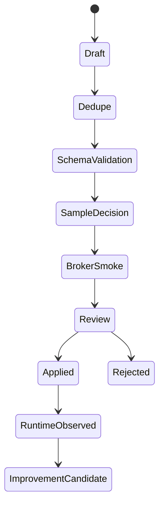

# 네 가지를 구분한다

| 개념 | 역할 |
|---|---|
| 외부 신호 | Webhook, API, MCP, Data Lake, Kafka, 일정에서 받은 원본 입력 |
| 업무 이벤트 정의 | 신호를 업무 발생으로 볼 조건, dedupe, 상태와 확인 방식 |
| Event Type | Broker, Workflow와 Action이 공유하는 검토된 업무 계약 |
| Event Stream | 실제 발생, 처리, 전이된 Event 이력 |

raw 신호를 모두 `boi.events`로 보내지 않는다. Business Event Detector가 의미 있는 순간을 판단한 뒤 Event Type contract에 맞는 이벤트만 발행한다.

# Event Metadata

| Field | 의미 |
|---|---|
| `event_type` | 업무 의미를 가진 안정적인 계약 ID |
| `payload_schema` | 업무 Event payload schema |
| `required_payload_fields` | routing과 materialization에 필요한 최소 필드 |
| `trace_policy` | trace 생성, 상속과 필수 여부 |
| `idempotency_key_fields` | 중복 발행 방지 기준 |
| `actor_policy` | 발행자 identity와 role 정책 |
| `visibility_policy` | 생성 BoI의 공개 범위 |
| `workflow_key` / `sop_ref` | 연결 Workflow와 SOP |
| `sop_stage_id` | 시작 또는 상태 전이 Task/stage |
| `recommended_actions` | 연결된 실행 요청 후보 |
| `emits_event_types` | 검증된 후속 Event Type |

Kafka topic은 transport이고 Event Type은 업무 의미다. topic 이름을 업무 계약으로 사용하지 않는다.

# Lifecycle

신규 Event Type은 draft로 시작한다. 기존 계약과 중복을 확인하고 schema, sample decision, Broker와 연결 Workflow smoke를 통과한 뒤 적용한다.

# 업무 이벤트 정의와의 경계

하나의 Event Type에 여러 source와 detector 정의가 연결될 수 있다. 예를 들어 `equipment.alarm.raised.v1`은 Webhook, Kafka raw topic 또는 API Poll에서 올 수 있지만 같은 업무 의미와 payload contract를 사용한다.

detector의 fingerprint, dedupe window, threshold와 상태 전환은 source별 판단 상태다. Event Type은 detector 내부 상태를 payload 전체로 노출하지 않는다.

# Agent 활용

BoI Agent는 Event Type을 질문했다고 모든 답변을 SOP 생성으로 전환하지 않는다. 설명 요청은 Event 의미, 실제 발생 이력과 직접 연결 관계를 보여준다. 사용자가 명시적으로 Workflow 연결, Event 초안 또는 Action 연결을 요청한 경우에만 private draft를 만든다.

# 관련 문서

- [업무 이벤트 정의 가이드](/docs/boi:public:boi-wiki-manual:workflows:business-event-definition-guide)
- [Event-Native Workflow](/docs/boi:public:boi-wiki-manual:workflows:event-native-workflow-guide)
- [Action 카탈로그와 실행 연결](/docs/boi:public:boi-wiki-manual:actions:multi-action-connector-guide)
