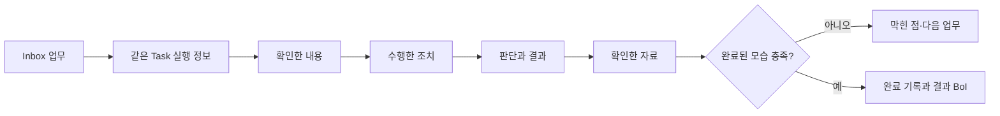
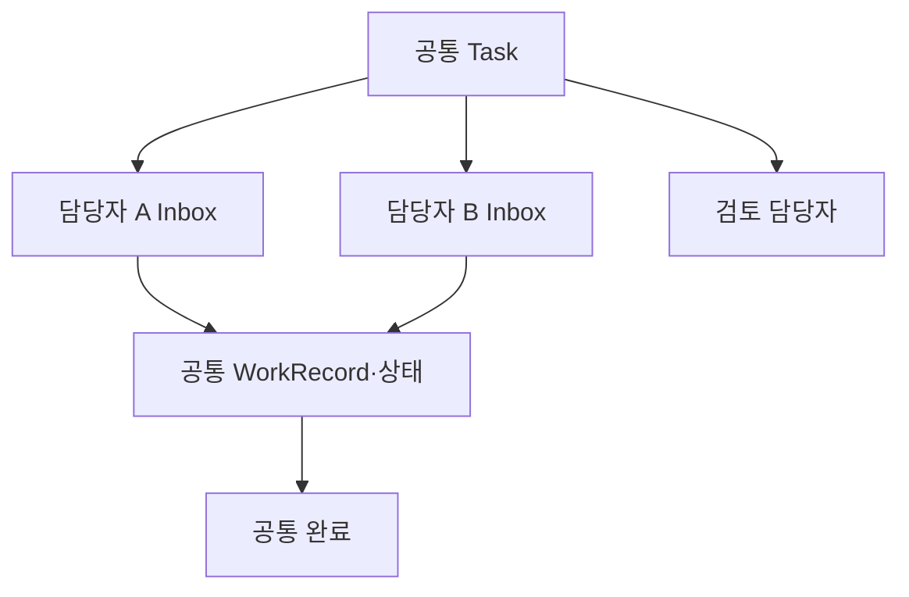

# Task는 실제 업무 기록이다

Task 수행 화면은 완료 체크만 누르는 곳이 아니다. 담당자는 현재 업무 흐름에서 다음 내용을 함께 남긴다.

- 무엇을 확인했는가
- 어떤 조치를 수행했는가
- 어떤 판단과 결과를 내렸는가
- 어떤 문서, 데이터, Event 또는 Action 결과를 근거로 사용했는가
- 무엇이 막혔고 다음에는 무엇을 해야 하는가

이 기록을 `TaskWorkRecord`라고 한다. 완료된 모습은 별도 버튼으로 완료시키지 않고, 업무 기록과 Evidence Ledger가 실제 완료 조건을 충족하는지로 판정한다.

# Manual, Copilot, Autopilot

| 수행 방식 | 업무 기록 | 완료 판정 |
|---|---|---|
| Manual | 사람이 확인 내용, 조치와 판단을 기록 | 사람 기록과 근거로 판정 |
| Copilot | AI가 준비한 자료와 사람이 내린 판단을 함께 기록 | 사람의 최종 판단이 있어야 완료 |
| Autopilot | Action 결과와 시스템 상태를 기록 | 검증 가능한 system binding으로만 완료 |

외부 AI에서 수행한 작업은 긴 대화 전문을 붙이지 않는다. 요약, 원본 위치, 체크섬과 대표 문장만 현재 Task에 연결한다.

# 여러 담당자가 같은 Task를 수행한다

Task에는 담당자, 검토 담당자와 유관 팀을 여러 개 지정할 수 있다. 지정된 담당자에게는 각자의 Inbox에서 같은 Task가 보인다. 현재 기본 완료 정책은 `담당자 중 한 명이 완료하면 공통 Task 완료`다.

배정은 자료 접근 권한을 자동으로 늘리지 않는다. 담당자에게 필요한 근거의 권한이 없다면 수행 준비 상태에 `접근 권한 필요`가 표시되어야 한다.

예를 들어 담당자 A가 올린 private 원본을 담당자 B에게 Task만 배정해도 원본 권한은 생기지 않는다. B는 접근 가능한 BoI, 현재 Event·Action 결과, 본인이 남긴 담당자 메모 또는 명시적으로 공유된 자료를 연결해야 완료할 수 있다.

# 업무 관계는 어디에 쓰이나

BoI Wiki는 Person, Team, BoI, SOP, Workflow, Task, Event, Action, Skill, Evidence와 결과 기록을 관계로 연결한다. 관계 그래프는 장식이 아니라 다음 작업의 입력이다.

- BoI Agent가 질문과 관련된 업무 맥락을 좁힐 때
- 담당자와 유관 팀, 실제 수행 이력을 찾을 때
- SOP 변경이 영향을 주는 Task와 Action을 확인할 때
- 현재 Task에 필요한 근거와 과거 사례를 찾을 때
- 지식의 출처와 변경 계보를 추적할 때

관계에는 출처와 신뢰 수준이 함께 기록된다. 문서에 선언되거나 실행 기록에서 추출된 관계는 바로 탐색에 사용할 수 있다. LLM이 추론한 관계는 검토되기 전까지 권한, 자동 배정과 완료 판정에 사용하지 않는다.

| 관계 상태 | 의미 |
|---|---|
| declared | 정본에 명시됨 |
| extracted | 구조와 실행 기록에서 결정적으로 추출됨 |
| inferred | AI가 의미상 제안함 |
| human_verified | 담당자가 검토함 |
| ambiguous | 둘 이상의 해석이 가능함 |

현재 배정, 공식 역할, 반복 수행과 관련 업무는 서로 다른 관계다. 반복 수행은 최근 180일의 서로 다른 업무에서 검증 완료가 세 번 이상일 때만 후보로 표시한다. 완료 기록이 없는 배정이나 inferred 관계만으로 “이 일을 잘하는 사람”이라고 결론 내리지 않는다.

# 질문에 맞는 표현을 고른다

BoI Agent는 모든 질문을 그래프로 만들지 않는다.

- 간단한 관계는 목록이나 표
- 시간 변화는 Timeline
- 짧은 업무 순서와 연결 경로는 Mermaid
- 많은 관계를 직접 탐색할 때는 Interactive Explorer

Interactive Explorer는 선택한 항목의 한 단계 관계부터 시작한다. 노드를 선택할 때만 주변 관계를 추가로 불러오므로 큰 Wiki 전체를 브라우저에 한꺼번에 올리지 않는다.

# 동적 화면의 안전 경계

BoI Agent와 Task 수행 화면은 결과에 맞는 입력과 결과물을 동적으로 보여줄 수 있다. 내부적으로는 A2UI 호환 표현을 사용하지만, 일반 사용자는 기술 형식을 알 필요가 없다.

- 도메인 결과를 먼저 만든 뒤 허용된 화면 구성으로 변환한다.
- Agent가 임의 HTML, URL 또는 실행 명령을 만들 수 없다.
- Action 실행과 변경은 기존 preview, Harness와 확인 절차를 그대로 거친다.
- 동적 화면을 지원하지 않는 환경에서는 기존 답변과 결과 화면으로 돌아간다.

# 검증된 사용 예

- Manual: 확인 내용과 조치를 기록하고, 접근 가능한 근거와 완료된 모습을 모두 확인해야 완료된다.
- Copilot: 내부·외부 AI 요약은 자료 준비이며 담당자 판단이 없으면 완료되지 않는다.
- Autopilot: 사람이 WorkRecord로 완료를 선언할 수 없고 system binding과 Action 결과가 필요하다.
- 복수 담당자: 각 Inbox에서 같은 흐름과 기록을 보며 한 명이 완료하면 공통 Task가 한 번만 완료된다.

상세 시나리오와 성능 기준은 [Task·Ontology·동적 화면 검증 기준](/docs/boi:public:boi-wiki-manual:operations:task-ontology-a2ui-acceptance)을 따른다.

# 함께 보기

- [BoI Agent 사용 가이드](/docs/boi:public:boi-wiki-manual:agent:using-boi-agent)
- [Inbox와 Task 수행 가이드](/docs/boi:public:boi-wiki-manual:inbox:inbox-and-task-guide)
- [SOP 만들기와 연결하기](/docs/boi:public:boi-wiki-manual:sop-workflows:create-and-connect-sop)
- [Living Knowledge System](/docs/boi:public:boi-wiki-manual:knowledge:living-knowledge-system)
- [Task·Ontology·동적 화면 검증 기준](/docs/boi:public:boi-wiki-manual:operations:task-ontology-a2ui-acceptance)
- [업무 관계와 동적 결과 활용 가이드](/docs/boi:public:boi-wiki-manual:agent:work-relations-and-dynamic-results)
