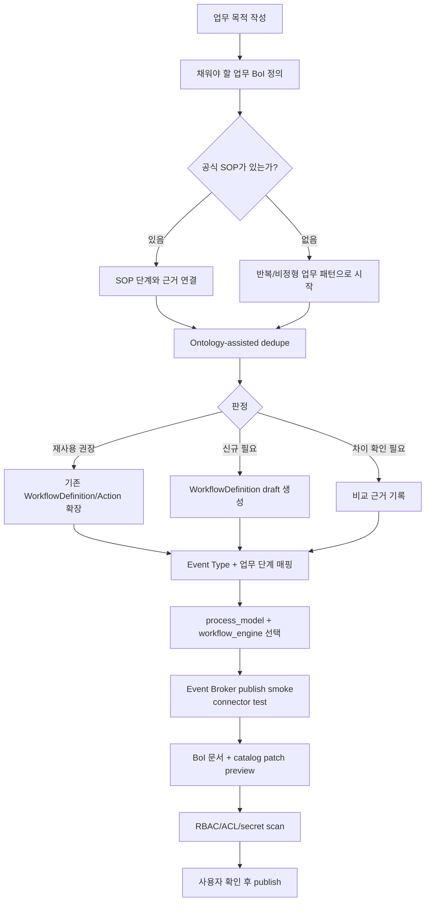

# Summary

BoI Wiki Pilot의 등록 단위는 단일 Action이 아니라 WorkflowDefinition이다. 시작점은 “무엇을 연결할 것인가”가 아니라 “어떤 업무 BoI를 채우려는가”다. API, MCP, Webhook, Langflow flow, Manual 업무, skill, harness, SOP는 업무 목적을 완결시키기 위한 구성요소로 연결한다.

SOP가 있으면 SOP 단계에 맞추고, SOP가 없으면 반복 업무나 비정형 업무 BoI로 시작한다. Langflow는 실행 방식 중 하나다. 기본 workflow engine은 `event_native`이며, Event Broker, 업무 BoI, Action Catalog, BoI Writer만으로 먼저 동작해야 한다.

사용자 화면에서는 `SOP 추가`가 기본 등록 진입점이다. 화면은 `Event -> SOP -> Action` 3단 구조로 구성되고, 각 섹션은 기존 항목 선택, 새 초안 만들기, 이번에는 건너뛰기를 지원한다. Event 추가와 Action 추가 링크는 각각 `/sops/new?focus=event`, `/sops/new?focus=action`으로 이 화면의 해당 섹션에 진입한다. 내부적으로는 registration draft 흐름을 타며, 기존 항목 검색, draft BoI와 catalog patch proposal 생성, 검증, 사용자 확인 후 publish 요청 순서가 동일하다. `/workflows/definitions`는 이 흐름의 고급 관리 화면이며, 처음 등록하는 사용자의 기본 진입점이 아니다.

# Registration Flow

# Required Objects

| Object | Purpose |
|---|---|
| Event Type | 업무가 발생했다는 runtime 계약 |
| WorkflowDefinition | 업무 목적, 업무 BoI, Event, SOP 또는 업무 단계, Action, Manual Handoff, evidence, affordance를 묶는 업무 흐름 |
| Action Skill | Agent가 Action을 어떤 업무 의미로 이해할지 설명 |
| Event Skill | Agent가 Event를 workflow trigger/transition으로 해석하는 기준 |
| Action Spec | Action Gateway가 실제 실행할 connector 계약 |
| BoI Manual | 사람이 읽고 검토할 운영 문서 |

# Process Model

| process_model | Meaning |
|---|---|
| `sop_based` | 공식 SOP가 있는 정형 업무 |
| `pattern_based` | SOP는 없지만 개인/팀이 반복 처리하는 업무 |
| `ad_hoc` | 일회성 비정형 업무 또는 임시 분석 |
| `external_orchestrator` | 외부 시스템이 주도하고 BoI Wiki가 업무 맥락과 근거를 관리하는 업무 |

# Publish Rule

WorkflowDefinition publish는 draft, dedupe, schema validation, Event Broker smoke, connector smoke, RBAC/ACL, secret scan을 통과해야 한다. 승인 전에는 catalog에 반영하지 않는다.

# Related Documents

- [Event Contract Guide](/public/boi-wiki-manual/workflows/event-contract-guide.md)
- [Event-Native Workflow Guide](/public/boi-wiki-manual/workflows/event-native-workflow-guide.md)
- [Action/Event Skill Registry Guide](/public/boi-wiki-manual/workflows/action-event-skill-registry-guide.md)
- [Duplicate Detection Guide](/public/boi-wiki-manual/workflows/duplicate-detection-guide.md)
- [Action Authoring Harness](/public/harness/action-authoring-harness.md)
- [업무 BoI-first 개념 모델](/public/boi-wiki-manual/concepts/work-boi-first-model.md)
