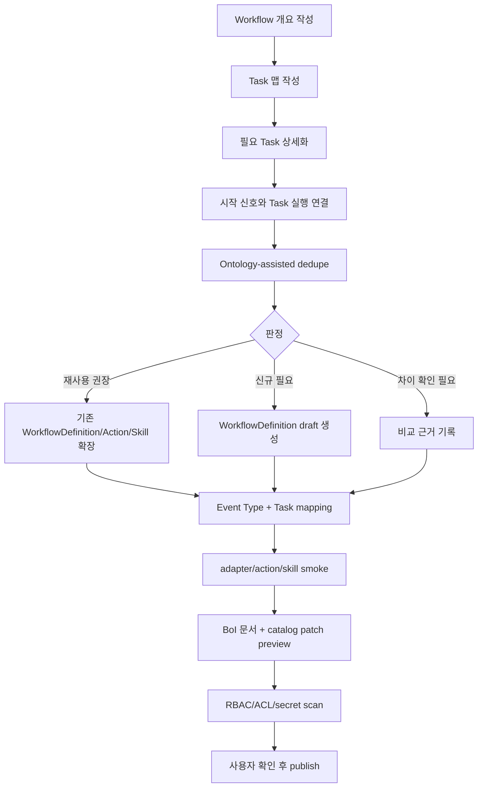

# Summary

BoI Wiki Pilot의 내부 등록 단위는 단일 Action이 아니라 WorkflowDefinition이다. 다만 일반 사용자의 작성 단위는 `Workflow / Task`다. 시작점은 “무엇을 연결할 것인가”가 아니라 “어떤 업무 맥락에서 어떤 판단과 결과를 남길 것인가”다. API, MCP, Webhook, Langflow flow, Manual 업무, skill, harness, SOP는 Task를 완결시키기 위한 실행 수단으로 연결한다.

SOP가 있으면 Workflow와 Task 맵으로 옮기고, SOP가 없으면 반복 업무나 비정형 업무 BoI에서 Workflow 틀을 시작한다. Langflow는 실행 방식 중 하나다. 기본 workflow engine은 `event_native`이며, Event Broker, 업무 BoI, Action Catalog, BoI Writer만으로 먼저 동작해야 한다.

사용자 화면에서는 `SOP 추가`가 기본 등록 진입점이다. 현재 `/sops/new`는 `Workflow 개요 -> Task 맵 -> Task 상세 -> 시작/연결 -> 검토·저장` Wizard다. Workflow 제목 또는 설명과 Task 1개 이상이면 틀을 저장할 수 있고, Task 상세는 `상세 미정`으로 남긴 뒤 나중에 보강할 수 있다. 내부적으로는 registration draft 흐름을 타며, 기존 항목 검색, draft BoI와 catalog patch proposal 생성, 검증, 사용자 확인 후 publish 요청 순서가 동일하다. `/workflows/definitions`는 이 흐름의 고급 관리 화면이며, 처음 등록하는 사용자의 기본 진입점이 아니다.

# Registration Flow

```mermaid
flowchart TD
  A["Workflow 개요 작성"] --> B["Task 맵 작성"]
  B --> C["필요 Task 상세화"]
  C --> D["시작 신호와 Task 실행 연결"]
  D --> E["Ontology-assisted dedupe"]
  E --> F{"판정"}
  F -->|"재사용 권장"| R["기존 WorkflowDefinition/Action/Skill 확장"]
  F -->|"신규 필요"| N["WorkflowDefinition draft 생성"]
  F -->|"차이 확인 필요"| X["비교 근거 기록"]
  R --> M["Event Type + Task mapping"]
  N --> M
  X --> M
  M --> T["adapter/action/skill smoke"]
  T --> PV["BoI 문서 + catalog patch preview"]
  PV --> G["RBAC/ACL/secret scan"]
  G --> U["사용자 확인 후 publish"]
```

# Required Objects

| Object | Purpose |
|---|---|
| Event Type | 업무가 발생했다는 runtime 계약 |
| Workflow | 사용자-facing 전체 업무 Process |
| Task | Workflow 안의 작은 업무 단위. 판단 질문, 근거, 실행 방식, 결과 BoI, TAT 기준을 가진다 |
| WorkflowDefinition | Workflow/Task, Event, Action, Skill, Manual Handoff, evidence, affordance를 묶는 내부 runtime 계약 |
| Action Skill | Agent가 Action을 어떤 업무 의미로 이해할지 설명 |
| Event Skill | Agent가 Event를 workflow trigger/transition으로 해석하는 기준 |
| Action Spec | Action Gateway가 실제 실행할 connector 계약 |
| BoI Manual | 사람이 읽고 검토할 운영 문서 |

# Task Execution Mode

| 사용자 표시 | 내부 필드 | 의미 |
|---|---|---|
| Manual | `execution_mode=manual` | 사람이 직접 판단/작업하고 결과를 남김 |
| Copilot | `execution_mode=copilot` | 내부 Agent/Skill/API 또는 외부 AI/도구 도움을 받아 사람이 최종 판단 |
| Autopilot | `execution_mode=autopilot` | Agent/System이 정책 범위 안에서 자동 실행하고 검증 기록을 남김 |

Copilot은 `copilot_source=internal|external|mixed|unknown`으로 세부 출처를 남긴다. 외부 Copilot은 세부 실행 로그를 요구하지 않고 결과 메모, 판단 근거, Data Lake artifact 또는 BoI 링크를 남기면 유효하다. Autopilot은 검증 정책, fallback owner, 승인 정책이 없으면 publish gate에서 막는다.

# Process Model

| process_model | Meaning |
|---|---|
| `sop_based` | 공식 SOP가 있는 정형 업무 |
| `pattern_based` | SOP는 없지만 개인/팀이 반복 처리하는 업무 |
| `ad_hoc` | 일회성 비정형 업무 또는 임시 분석 |
| `external_orchestrator` | 외부 시스템이 주도하고 BoI Wiki가 업무 맥락과 근거를 관리하는 업무 |

# Publish Rule

WorkflowDefinition publish는 draft, dedupe, schema validation, Event Broker smoke, connector smoke, RBAC/ACL, secret scan을 통과해야 한다. 승인 전에는 catalog에 반영하지 않는다.

# Related Documents

- [Workflow/Task Builder 따라하기](/docs/boi:public:boi-wiki-manual:sop-workflows:workflow-task-builder-step-by-step)
- [업무 BoI-first 개념 모델](/public/boi-wiki-manual/concepts/work-boi-first-model.md)
- [Event Contract Guide](/public/boi-wiki-manual/workflows/event-contract-guide.md)
- [Event-Native Workflow Guide](/public/boi-wiki-manual/workflows/event-native-workflow-guide.md)
- [Action/Event Skill Registry Guide](/public/boi-wiki-manual/workflows/action-event-skill-registry-guide.md)
- [Duplicate Detection Guide](/public/boi-wiki-manual/workflows/duplicate-detection-guide.md)
- [Action Authoring Harness](/public/harness/action-authoring-harness.md)
