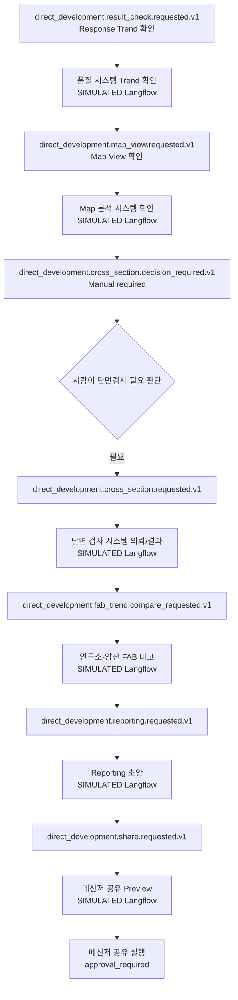

# Summary

이 BoI는 `sop_sample_image.png`의 "직개발 결과 확인 및 Reporting" 흐름을 public redacted SOP로 자산화한 기준 문서다. 업무 대상은 `Tech-A`로 비식별화하며, 실제 사내 시스템명은 `품질 시스템`, `Map 분석 시스템`, `단면 검사 시스템`, `메신저`, `연구소-양산 FAB`만 사용한다.

PoC에서 실제 사내 시스템은 연결하지 않는다. 시스템 호출이 필요한 action은 `BoI Universal Action Simulator Flow`를 거치는 공식 시뮬레이션 실행으로 남기고, 모든 결과에는 `SIMULATED`와 "실제 시스템 호출 아님"을 표시한다.

# Source Image


# AI Native Workflow

| 단계 | 업무 의미 | Event Type | 실행 방식 | 주요 Action |
|---|---|---|---|---|
| Response Trend 확인 | 직개발 결과의 Response Trend를 확인 | [direct_development.result_check.requested.v1](/public/event-types/direct_development.result_check.requested.v1.md) | `SIMULATED` Langflow | [품질 시스템 Trend 확인](/public/actions/langflow/direct-development-quality-response-trend-simulate.md) |
| Map View 확인 | Map View Image를 확인 | [direct_development.map_view.requested.v1](/public/event-types/direct_development.map_view.requested.v1.md) | `SIMULATED` Langflow | [Map View 확인](/public/actions/langflow/direct-development-map-view-simulate.md) |
| 단면검사 판단 | 사람이 단면검사 필요 여부 판단 | [direct_development.cross_section.decision_required.v1](/public/event-types/direct_development.cross_section.decision_required.v1.md) | Manual required | [단면검사 필요 여부 판단](/public/actions/manual/direct-development-decide-cross-section.md) |
| 단면검사 의뢰/결과 확인 | 단면 검사 시스템 의뢰와 결과 확인 | [direct_development.cross_section.requested.v1](/public/event-types/direct_development.cross_section.requested.v1.md) | `SIMULATED` Langflow | [단면검사 의뢰](/public/actions/langflow/direct-development-cross-section-request-simulate.md), [결과 확인](/public/actions/langflow/direct-development-cross-section-result-simulate.md) |
| 연구소-양산 FAB 비교 | 비교 Trend를 확인 | [direct_development.fab_trend.compare_requested.v1](/public/event-types/direct_development.fab_trend.compare_requested.v1.md) | `SIMULATED` Langflow | [비교 Trend 확인](/public/actions/langflow/direct-development-fab-trend-compare-simulate.md) |
| Reporting | 분석 근거를 보고 초안으로 정리 | [direct_development.reporting.requested.v1](/public/event-types/direct_development.reporting.requested.v1.md) | `SIMULATED` Langflow | [Reporting 초안 생성](/public/actions/langflow/direct-development-reporting-simulate.md) |
| 협의체 공유 | 공유 preview 생성 후 승인 전 정지 | [direct_development.share.requested.v1](/public/event-types/direct_development.share.requested.v1.md) | `SIMULATED` preview + approval required | [메신저 공유 preview](/public/actions/langflow/direct-development-messenger-share-preview-simulate.md), [메신저 공유 실행](/public/actions/webhook/direct-development-messenger-share-publish.md) |

# Mermaid Flow



# Simulation Boundary

- `SIMULATED` action은 실제 사내 시스템을 호출하지 않는다.
- `real_system_connected=false`, `real_system_status=unavailable`을 action log와 workflow status에 남긴다.
- `BoI Universal Action Simulator Flow`는 SOP/action/context를 읽고, 동일한 result contract로 한국어 요약과 구조화 JSON을 생성한다.
- `단면검사 판단` stage는 Response Trend와 Map View evidence가 필수다. 실제 시스템이 없을 때도 Universal Simulator는 [단면검사 필요 여부 판단](/public/actions/manual/direct-development-decide-cross-section.md)의 evidence contract를 따라 `SIMULATED prerequisite` packet을 만들고 provenance를 표시해야 한다.
- 사람이 판단해야 하는 단계는 자동 완료하지 않는다. smoke harness에서만 "수동 완료 event를 발행했다"는 별도 evidence를 남겨 end-to-end 흐름을 검증한다.
- 메신저 공유 실행은 preview와 approval-required를 분리한다. 승인 전에는 실제 발송하지 않는다.

# Public Interfaces

```bash
curl -X POST "http://localhost:8000/api/workflows/direct-development-reporting/start?employee_id=100001" \
  -H "x-service-token: $SERVICE_TOKEN" \
  -H "Content-Type: application/json" \
  -d '{"user_confirmed":true}'
```

```bash
curl "http://localhost:8000/workflows/direct-development-reporting/status?employee_id=100001&trace_id=$TRACE_ID"
```

```bash
curl "http://localhost:8000/api/workflows/direct-development-reporting/status/raw?employee_id=100001&trace_id=$TRACE_ID" \
  -H "x-service-token: $SERVICE_TOKEN"
```

# Citations

- Source image: `/public/boi-wiki-manual/_media/source/natural-language-poc/sop_sample_image.png`
- Event catalog: `data/event_catalog/event_types.yaml`
- Action catalog: `data/action_catalog/actions.yaml`
