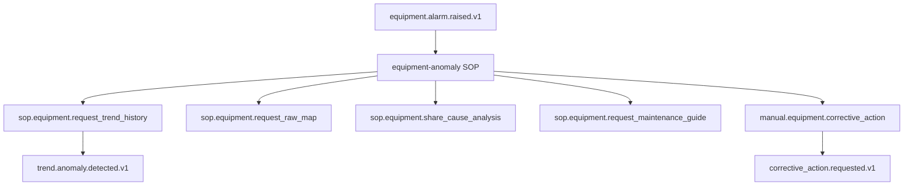

# Summary

이 WorkflowDefinition는 `equipment.alarm.raised.v1` Event가 들어왔을 때 설비 이상 대응 SOP를 시작하고, Trend/Map evidence, 원인 분석, 정비 가이드, 수동 조치를 BoI evidence로 연결한다.

# Event-Native Flow

# Agent Use

BoI Agent는 이 WorkflowDefinition을 근거로 “이 이벤트가 발생하면 뭘 해야 해?” 질문에 Event, SOP Stage, Action, Manual Handoff, Next Event 흐름을 답한다. 연결되지 않은 후속 행동은 추천하지 않는다.

# Related

- [설비 이상 감지·원인 분석·이상 조치 SOP](/public/sop/equipment-abnormal-response.md)
- [Event Contract Guide](/public/boi-wiki-manual/workflows/event-contract-guide.md)
- [Event-Native Workflow Guide](/public/boi-wiki-manual/workflows/event-native-workflow-guide.md)
