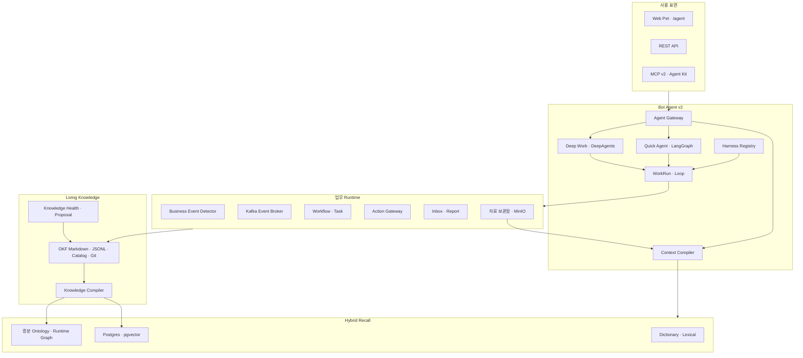
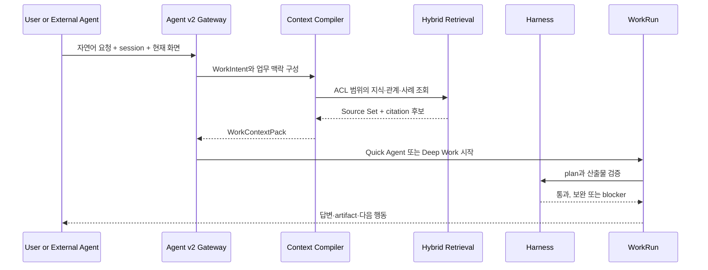
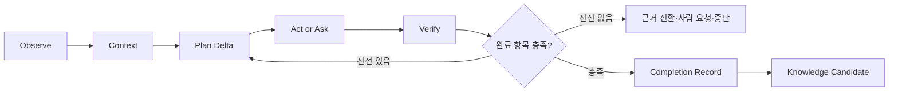
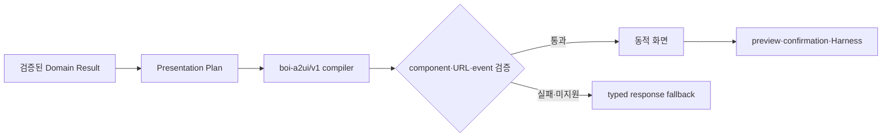
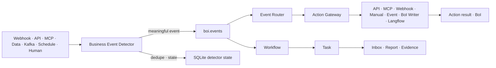

# 한 문장 정의

BoI Wiki는 OKF Markdown과 Git을 지식 정본으로 유지하면서, Agent가 업무 맥락을 구성하고 Wiki 전체의 지식과 실행 이력을 활용해 Workflow/Task를 수행하며, 검증된 결과를 다음 업무에 재사용하는 Work Learning System이다.

# 전체 구조

# 설계 원칙

| 원칙 | 의미 |
|---|---|
| BoI-first | 질문, Task, Event, Action을 업무 맥락과 결과 BoI로 연결한다. |
| 정본과 조회 모델 분리 | Markdown·JSONL·catalog·Git은 정본, pgvector와 ontology는 재생성 가능한 read model이다. |
| 현재 화면은 anchor | 현재 문서와 Task는 중요한 해석 기준이지만 Wiki 전체 검색을 제한하지 않는다. |
| LLM 의미 판단 + 코드 검증 | 의도와 계획은 LLM이 판단하고 ACL, schema, 근거, 위험도와 완료 조건은 코드가 강제한다. |
| 진전 기반 Loop | 새 근거, 사람 입력, Action 결과, artifact, 상태 변화 또는 blocker가 없으면 반복하지 않는다. |
| Draft before mutation | Agent와 DeepAgents 결과는 초안이다. 게시와 외부 부작용은 preview, RBAC, confirmation을 거친다. |
| Context isolation | 긴 원본과 민감 데이터는 prompt 밖에 두고 summary, profile, sample, checksum과 ACL URL만 전달한다. |
| Connector peer model | API, Webhook, MCP, Manual, Event, BoI Writer, Langflow는 Action Gateway 아래의 동등한 실행 연결이다. |

# Surface와 동일 계약

Web Pet, `/agent`, REST, MCP와 Codex/Claude Agent Kit은 같은 WorkSession, GoalPlan, Source Set, citation, WorkRun, Harness 결과와 artifact ID를 사용한다. Web은 사용자에게 기술 capability를 노출하지 않고 자연어 요청을 자동 route한다. 외부 자동화가 결정적인 기능을 요구할 때만 capability를 명시한다.

Pet은 유일한 기본 Agent 진입점이다. `/agent`는 같은 surface의 Fullpage 주소이며 Builder와 개인 외부 연결은 Expanded·Fullpage의 `⋯` 메뉴에서 연다. Advanced는 API/MCP contract, 권한과 integration 진단만 맡는다.

StarterSuggestionSet은 ACL-visible Inbox, route-resolved 현재 문서, 최근 WorkSession·artifact, 팀 지식과 명시적인 `agent_entrypoint` 문서로 후보를 구성한다. 로컬 LLM은 제공된 source ref와 허용 operation 안에서 사용자에게 맞는 표현을 고르며, Pet 열기는 cached context fingerprint를 먼저 사용한다.

# Context Engineering

`WorkContextPack`은 다음 항목을 선별한다.

- 업무 목표와 현재 페이지
- 진행 중 Workflow/Task와 수행 방식
- 완료된 모습과 확인할 자료
- 확보된 근거와 부족한 근거
- 관련 BoI, SOP, Event, Action, Skill
- 유사 사례와 최근 loop delta
- 자료 보관함 artifact의 summary, profile, sample, checksum과 ACL URL
- 외부 AI 결과의 요약과 provenance

Context Compiler는 `write/select/compress/isolate`를 적용한다. 최근 대화와 활성 artifact는 WorkSession에 저장하고, 현재 단계에 필요한 것만 선택하며, 오래된 대화는 압축하고, 긴 원본은 MinIO에 격리한다. `ContextManifest`는 사용하거나 제외한 source와 이유, revision, token budget과 provenance를 기록한다.

# WorkRun과 Loop Engineering

매 iteration은 Evidence, Action 결과, 사람 입력, artifact, 상태 전환, blocker 또는 지식 후보 중 하나를 `LoopDelta`로 남겨야 한다. 같은 query, tool+args, 질문과 결과 없는 재계획은 no-progress로 중단한다. Task 완료는 LLM 자기 선언이 아니라 구조화된 완료 항목, Evidence Ledger, Action 결과와 사람 확인으로 결정한다.

# Manual, Copilot, Autopilot

| Mode | 실행 경계 |
|---|---|
| Manual | 사람이 수행·확인하고 Agent는 지식, 근거와 기록을 지원한다. |
| Copilot | 내부 또는 외부 AI가 자료·초안을 준비하고 사람이 최종 확인한다. |
| Autopilot | allowlist의 저위험 Action과 system binding으로 검증 가능한 항목만 자동 완료한다. |

client는 서버가 허용한 Task mode보다 권한을 높일 수 없다. 중·고위험 및 외부 부작용은 mode와 무관하게 confirmation이 필요하다.

# Hybrid Retrieval

검색은 Dictionary/ontology 해석, lexical, pgvector embedding, graph/runtime 관계, 권위·최신성·Task 맥락 rerank를 결합한다. 일반 turn은 선별된 source와 chunk만 Context에 넣는다. `history_seed`는 유사 사례에서만 사용하고 현재 Inbox나 내 할 일에 포함하지 않는다.

| 정본 | 조회 모델 |
|---|---|
| OKF Markdown | `boi_search_documents`, `boi_search_chunks` |
| Event/Action JSONL | runtime case와 trace read model |
| Event·Action·Workflow catalog | ontology node/edge |
| Git revision·checksum | source manifest와 incremental sync |

embedding 장애 시 lexical과 ontology 검색은 계속 제공한다. semantic 검색을 성공한 것처럼 표시하지 않고 요청 단위로 degraded 상태를 전달한다.

# Living Knowledge

Knowledge Compiler는 OKF Markdown, Git과 자료 보관함 source를 checksum과 revision으로 증분 처리한다. 구조 관계는 parser와 catalog에서 결정적으로 추출하고, LLM이 만든 의미 관계는 inferred provenance와 confidence를 가진 후보로만 저장한다.

Knowledge Health는 stale claim, contradiction, duplicate, orphan, broken link와 coverage gap을 찾고 `KnowledgePatchProposal`을 만든다. checksum, backlink, index 같은 결정적 복구만 자동 적용할 수 있다. Team/Public 의미 변경은 review 전 정본을 수정하지 않는다.

Ontology 갱신은 전체 table truncate가 아니라 source revision별 node·edge upsert와 tombstone 삭제로 수행한다. Person, Team과 Task 배정 관계도 같은 graph 계약을 쓰지만, inferred 관계는 검토 전 권한·자동 배정·완료 판정에 사용할 수 없다. `WorkRoleProfile`은 최근 180일의 서로 다른 검증 완료 실행이 세 건 이상일 때만 반복 수행 관계를 만든다. 범용 `GraphQueryPlan`은 neighbors, path, workflow, impact, lineage, responsibility, timeline, compare, tour를 parameterized query로 실행하며 LLM이 SQL이나 Cypher를 직접 만들지 않는다.

자연어 관계 질문은 `GraphQueryDraft → EntityResolver → GraphQueryPlan → parameterized graph query` 순서로 실행한다. Planner는 사람·팀·자산 표현과 원하는 결과만 제안하며 SQL·Cypher를 만들지 않는다. `current`, `responsibility`, `combined` 업무 관점은 현재 Inbox와 공식 역할·검증 수행 이력을 분리한다.

Quick Agent의 structured Planner는 자연어 route, grounded answer와 private SOP outline을 하나의 schema에서 반환할 수 있다. source는 짧은 key로만 참조하고 서버가 실제 retrieved ref로 다시 해석한다. grounded claim이 검색 경계 밖이거나 SOP Task에 완료 기준·필수 근거가 없으면 결과를 폐기하고 검증된 fallback을 사용한다. semantic route schema가 바뀌면 cache version을 올려 오래된 route가 새 계약을 우회하지 못하게 한다.

Task 실행은 `TaskExecutionSnapshot`을 Inbox와 Task Console의 공통 read model로 사용한다. `TaskWorkRecord`는 확인 내용, 조치, 판단, 결과와 근거를 보존하고 복수 담당자는 하나의 Task 상태를 공유한다.

Agent와 Task의 동적 표현은 A2UI protocol `0.9.1`과 `@a2ui/web_core/v0_9`, `@a2ui/lit/v0_9` runtime을 사용하는 `boi-a2ui/v1` catalog로 컴파일한다. 서버는 `createSurface → updateComponents → updateDataModel` 메시지와 persisted data model을 저장하고 Web은 공식 processor 위에 업무 component를 등록한다. A2UI는 정본이나 업무 규칙이 아니며, 허용된 component와 event만 렌더링한다. 지원하지 않는 client 또는 검증 실패 시 기존 typed response renderer 하나만 사용한다.

Planner가 이미 만든 Domain Result는 deterministic compiler가 surface와 artifact로 바꾼다. 표·Timeline·Mermaid·Ontology Explorer를 위해 추가 모델 호출을 만들지 않으며, SSE는 `accepted → context → retrieval → evaluation → createSurface → updateComponents/updateDataModel → final` 순서를 유지한다.

Harness 개선도 같은 표현 계층을 사용하지만 production mutation 경계와 분리한다. WorkRun의 verifier 실패는 인과적 FailurePattern과 NegativeResult로 누적되고, ContextPlaybook은 개인·팀·model profile·freshness 조건이 맞는 항목만 선택한다. Candidate는 editable surface allowlist와 반복 상한을 통과한 뒤 shadow, held-in/out, adversarial, long-term 평가와 사람 검토를 거친다.

```mermaid
flowchart LR
  RUN["WorkRun + HarnessVersion"] --> FAILURE["FailurePattern"]
  FAILURE --> CANDIDATE["HarnessCandidate"]
  CANDIDATE --> SHADOW["Server Shadow Preflight"]
  SHADOW --> EVAL["Held-in · Held-out · Safety"]
  EVAL --> REVIEW["Human Review"]
  REVIEW --> VERSION["approved_not_deployed"]
  VERSION -. "별도 수동 배포" .-> RUNTIME["Production Harness"]
```

HarnessVersion, EvaluationRun, FailurePattern, Candidate와 ContextPlaybookItem은 관리자 ACL의 운영 Ontology node다. 일반 지식 그래프와 같은 저장·질의 계약을 쓰되 공용 source, 자동 권한, 완료 판정과 전문성 근거로 사용하지 않는다.

Web client는 저장된 surface를 다시 조회하고 허용된 component registry로 실제 DOM을 만든다. 표, Timeline, Mermaid, Ontology Explorer, WorkRecordForm, EvidencePicker와 Confirmation이 1차 catalog다. Confirmation은 기존 plan·Harness·confirmation API만 호출하며 relation presentation hint가 work routine handler를 가로채지 못한다. surface validation과 fallback 상태는 Advanced `연결 상태`의 관리자용 접힌 진단에서만 확인하며 일반 사용자에게 protocol 이름을 노출하지 않는다.

Ontology Explorer는 Agent와 `/knowledge-graph`가 같은 Graphology·Sigma renderer를 사용한다. Agent Expanded에서는 관계 artifact에 34:66 분할을 적용하고, 680px보다 좁은 첫 canvas는 결과 집중 보기로 전환한다. 선택 상세는 canvas 옆 열을 만들지 않고 아래쪽 inspector로 열어 그래프 폭을 보존한다. canvas는 node label과 방향 화살표를 우선하고 관계 이름·provenance는 범례, 필터와 inspector에서 제공해 교차 edge의 문구 겹침을 막는다. `PetSurfaceState`는 artifact별 선택 node, inspector, camera와 focus mode를 저장한다. Compact에서는 Sigma instance를 만들지 않으며 배경으로 내려간 renderer도 camera를 저장한 뒤 해제한다.

Mermaid runtime은 versioned module chunk로 번들링해 gzip으로 전송하고 browser idle에 미리 준비한다. transient load는 두 번 재시도하고 문법 오류와 구분한다. 실제 SVG compile은 질문 대상의 검증된 Ontology 관계를 우선하는 deterministic artifact source를 사용하며 답변·후속 질문·동적 화면 때문에 별도 LLM 호출을 추가하지 않는다. OpenKB compatibility gateway도 모델 관리 API를 호출하지 않고, `json_object` 요청만 일반 JSON 요청으로 변환한 뒤 schema 검증과 단 한 번의 복구를 수행한다.

응답 크기 제한은 표현 중복을 먼저 줄이고 WorkIntent와 최소 citation을 보존한다. citation이 제거된 응답을 `grounded`로 표시해서는 안 된다. 이 경계는 [Task·Ontology·동적 화면 검증 기준](/docs/boi:public:boi-wiki-manual:operations:task-ontology-a2ui-acceptance)의 결정적 테스트와 실모델 시나리오로 검증한다.

# Business Runtime

Business Event Detector는 raw payload 전체를 기본 저장하지 않고 fingerprint, count, last_seen, 상태와 decision summary만 SQLite에 유지한다. 의미 있는 Event만 `boi.events`로 보낸다. Action Gateway는 connector 설정, host allowlist, dry-run, 위험도, 승인과 결과 계약을 통제한다.

사용자 Event 이력은 raw row가 아니라 trace 기반 `BusinessEventOccurrence` read model이다. Event, 연결 SOP, Action, 남은 사람 확인과 결과 BoI를 한 건으로 투영한다. raw lookup과 `/api/events/log`는 진단·호환 계약으로 유지한다.

# API·MCP와 연결 상태

공개 REST contract는 `/openapi-v2.json`의 `2.0`이며 `/api/reference`가 이를 렌더링한다. MCP v2는 `/mcp/v2`에서 기본 도구 10개만 제공하고 progressive discovery로 세부 기능을 찾는다. Web·REST·MCP는 같은 identity, source, citation, occurrence와 artifact를 반환한다.

`IntegrationHealthRegistry`는 Kafka topic metadata, MinIO liveness, MCP contract와 도구 수, Action Gateway health, 선택형 Langflow를 독립적으로 probe한다. 사용자 요청은 cached snapshot만 읽으며 느린 integration이 메뉴 렌더링을 막지 않는다.

# 데이터와 저장소

| 저장소 | 역할 |
|---|---|
| `data/boi` | Public, Team, Private OKF Markdown 정본 |
| `data/event_catalog`, `data/action_catalog`, `data/workflow_catalog` | 업무 계약과 실행 정의 정본 |
| active runtime root | 새 Event, Action, report coordinator와 실행 상태 |
| history seed root | 기존 demo·과거 Event/Action 이력의 read-only 조회 |
| Agent Postgres + pgvector | WorkSession, WorkRun, job, offer, plan, evaluation, 검색 read model |
| MinIO | 긴 원본 파일과 artifact 정본 |
| Git | shared 문서 변경 이력, review와 rollback |

# Runtime Services

| Service | 기본 역할 | 비고 |
|---|---|---|
| BoI API/Web | 문서, Agent v2, Inbox, SOP, Event, Action, Data Library | container 8000, local dev 8765, Docker host 기본 28000 |
| Agent Postgres/pgvector | Agent 상태와 검색 read model | Langflow DB와 분리 |
| Deep Worker | DeepAgents job, checkpoint, retry, cancel | 결과는 draft |
| Kafka/Event Router | 업무 Event 전달과 dispatch | `boi.events`, 필요 시 `boi.raw-signals` |
| Action Gateway | connector 실행과 정책 통제 | 선택 장애가 문서 탐색을 막지 않음 |
| MinIO | bundled 자료 보관함 | 표준 설치 기본 |
| BoI Wiki MCP | 외부 Agent 인터페이스 | `/mcp/v2`, 기본 10 tools |
| LM Studio/OpenAI-compatible | generation과 embedding | 앱은 load/unload API를 호출하지 않음 |
| Langflow | 선택형 flow/Action connector와 시각화 | Agent 핵심 runtime 아님 |

# Model Policy

로컬과 사외 실행은 설정된 LM Studio/OpenAI-compatible generation model과 embedding model을 사용한다. GPT-5.5는 `BOI_GPT55_TEST_MODE=true`를 명시한 비교 검증에서만 허용한다. 개발 PC의 preloaded model guard는 LM Studio native model list로 이미 상주한 모델만 확인하고 load/unload를 수행하지 않는다.

# Access와 Mutation 경계

읽기 권한은 인증 identity, visibility, team, role, classification과 source ACL의 교집합이다. v2 PAT 요청은 query의 `employee_id`를 신뢰하지 않는다. 실제 Action, public/team publish, promotion, catalog 적용은 `preflight → plan → validate → preview/test → confirmation → apply/run → post-verify`를 통과한다.

# Deployment Modes

| Mode | 구성 |
|---|---|
| Local dev | repo content, active runtime, history seed, local Kafka, bundled MinIO, MCP v2 |
| local-full | Docker에서 API, Agent Postgres, worker, Kafka, MinIO, MCP와 선택형 Langflow를 함께 검증 |
| pilot-external | 사내 Kafka·model·storage endpoint를 env로 연결하고 content/runtime ownership을 분리 |
| special recovery | 명시적으로만 자료 업로드나 선택 integration을 끄고 정본 문서 조회를 유지 |

# 확장 원칙

| 필요 | 변경 위치 |
|---|---|
| 새 업무 발생 방식 | BusinessEventDefinition과 source bridge |
| 새 실행 프로토콜 | Action Gateway connector 또는 MCP progressive discovery |
| 새 Agent 기능 | versioned CapabilityDefinition과 HarnessDefinition |
| 새 지식 원천 | KnowledgeSourceAdapter |
| 새 검색 표현 | ontology extractor와 reranker, 정본 변경 없음 |
| 새 외부 Agent | MCP v2 또는 Agent Kit client, 공통 권한 유지 |

# 운영 위험

- 구형 v1 문서가 검색 상위에 오르면 현재 Agent 계약을 잘못 설명한다. deprecated 문서는 기본 retrieval에서 제외한다.
- generated Source Wiki를 정본보다 높게 평가하지 않는다. source revision이 낡으면 재생성하거나 검색에서 후순위화한다.
- Data Lake 원본을 embedding하거나 prompt에 통째로 넣지 않는다.
- Langflow, Action Gateway 같은 선택 서비스 장애를 BoI Wiki 전체 장애로 표시하지 않는다.
- Knowledge Health proposal을 사람 검토 없이 Team/Public 의미 변경에 적용하지 않는다.

# 관련 문서

- [BoI Wiki 종합 가이드](/docs/boi:public:boi-wiki-manual:guide:final-operator-guide)
- [Work Learning System](/docs/boi:public:boi-wiki-manual:agent:work-learning-system)
- [Living Knowledge System](/docs/boi:public:boi-wiki-manual:knowledge:living-knowledge-system)
- [Task 수행과 업무 관계 활용 가이드](/docs/boi:public:boi-wiki-manual:workflows:task-execution-ontology-guide)
- [BoI Wiki 운영 Runbook](/docs/boi:public:boi-wiki-manual:operations:operator-runbook)
- [BoI Wiki MCP 등록과 사용](/docs/boi:public:boi-wiki-manual:mcp:register-and-use-boi-wiki-mcp)
